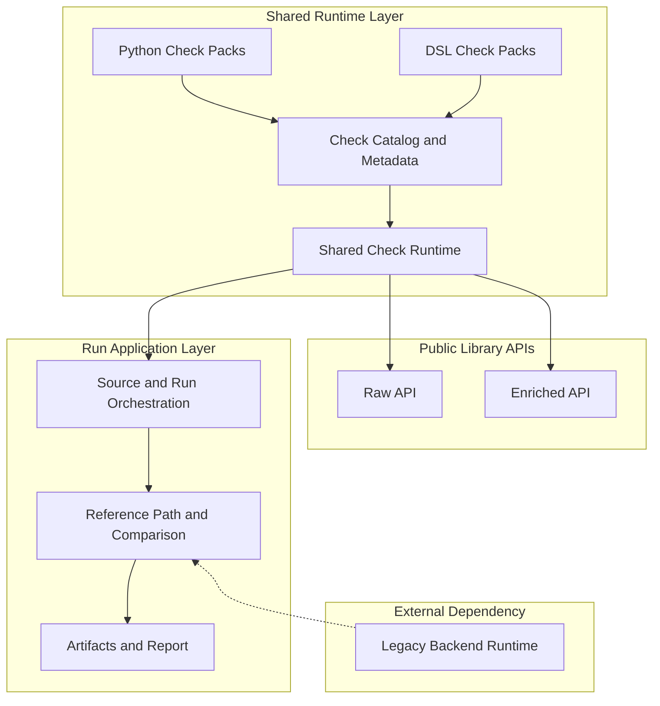

# Open Food Facts - Data Quality

Framework prototype for migrating Open Food Facts data quality checks from Perl to Python with parity validation against the legacy backend.

The repository has three parts:

- a reusable Python library that packages migrated checks and country specific checks
- an application layer that runs checks, loads reference data when needed, and renders review artifacts
- migration tooling that analyzes legacy Perl sources and produces review artifacts

## Purpose

Open Food Facts already has trusted data quality logic in the legacy backend. This repository adds:

- a check runtime that remains useful after the migration project
- a disciplined way to compare migrated behavior against the legacy backend when parity is expected
- artifacts that help reviewers understand what changed, what still mismatches, and what remains to migrate

## Capabilities

- run the demo and view the generated quality run report
- execute the application locally against a DuckDB snapshot
- use the Python library directly on `raw_products` rows or on stable explicit `enriched_products` snapshots
- author checks in Python or in the repository DSL
- generate legacy inventory artifacts to support migration planning

## Layers



<table>
  <thead>
    <tr>
      <th>Layer</th>
      <th>Layer Description</th>
      <th>Block</th>
      <th>Block Description</th>
    </tr>
  </thead>
  <tbody>
    <tr>
      <td rowspan="4"><code>Shared Runtime Layer</code></td>
      <td rowspan="4">Defines the reusable check runtime used by the public library APIs and by the application run layer.</td>
      <td><code>Python Check Packs</code></td>
      <td>Packaged Python checks included in the shared runtime.</td>
    </tr>
    <tr>
      <td><code>DSL Check Packs</code></td>
      <td>Packaged DSL checks included in the shared runtime.</td>
    </tr>
    <tr>
      <td><code>Check Catalog and Metadata</code></td>
      <td>Loads packaged checks and exposes the metadata used to select them by input surface, parity baseline, and jurisdiction.</td>
    </tr>
    <tr>
      <td><code>Shared Check Runtime</code></td>
      <td>Builds normalized contexts and executes selected checks for the raw and enriched input surfaces.</td>
    </tr>
    <tr>
      <td rowspan="2"><code>Public Library APIs</code></td>
      <td rowspan="2">Expose the shared runtime directly to Python callers without the application run and report layer.</td>
      <td><code>Raw API</code></td>
      <td>Public API for running checks on raw public product rows.</td>
    </tr>
    <tr>
      <td><code>Enriched API</code></td>
      <td>Public API for running checks on explicit enriched snapshots.</td>
    </tr>
    <tr>
      <td rowspan="3"><code>Run Application Layer</code></td>
      <td rowspan="3">Builds on the shared runtime and adds source loading, optional reference loading, strict comparison, artifacts, and report rendering.</td>
      <td><code>Source and Run Orchestration</code></td>
      <td>Loads source products, selects active checks, and executes the migrated runtime for one run.</td>
    </tr>
    <tr>
      <td><code>Reference Path and Comparison</code></td>
      <td>Loads cached or freshly materialized reference results, exposes enriched snapshots owned by the Python runtime, and applies strict comparison where a legacy baseline exists.</td>
    </tr>
    <tr>
      <td><code>Artifacts and Report</code></td>
      <td>Emits JSON artifacts and renders the static review site for compared and runtime only checks.</td>
    </tr>
    <tr>
      <td><code>External Dependency</code></td>
      <td>The external Perl runtime used to produce reference results for runs that need backend enrichment or strict comparison.</td>
      <td><code>Legacy Backend Runtime</code></td>
      <td>Emits a versioned backend result envelope whose stable payload is `ReferenceResult`, including enriched snapshots and legacy finding tags.</td>
    </tr>
  </tbody>
</table>

## Demo

Run the demo before cloning the repository. Docker is the only requirement.

```bash
docker run --rm -p 8000:8000 ghcr.io/bobcorn/openfoodfacts-data-quality:demo
```

The first start can take a short while because Docker must pull the image and build the sample report.

Open [http://localhost:8000](http://localhost:8000) to view the report.

The demo:

- runs against the included DuckDB sample
- executes migrated checks
- compares findings where a legacy baseline exists
- writes the HTML report plus `run.json` and `snippets.json`
- serves the generated site locally
- uses cached reference results and calls the legacy backend only on cache misses

## Local Workflows

### Docker Setup

Use Docker for local application runs that need reference data, report generation, or other steps that span multiple components.

```bash
git clone https://github.com/bobcorn/openfoodfacts-data-quality.git
cd openfoodfacts-data-quality
cp .env.example .env
docker compose up --build
```

Then open [http://localhost:8000](http://localhost:8000).

Defaults:

- `.env` points to the tracked sample DuckDB snapshot
- the default `full` profile runs included compared and runtime only checks
- outputs are written under `artifacts/latest/`
- reference results are cached across runs
- cached products skip live legacy backend execution
- source code is not mounted into the container, so code changes require a rebuild

### Python Setup

Use Python for library work, tests, typing, linting, and repository utilities.

```bash
python3.14 -m venv .venv
.venv/bin/python -m pip install -e ".[app,dev]"
```

Use Docker for compared runs, enriched application runs, report rendering, and preview. Those workflows depend on the supported legacy backend environment.

## Library

The public Python API has two input surfaces:

- `openfoodfacts_data_quality.raw`
- `openfoodfacts_data_quality.enriched`

Minimal raw example:

```python
from openfoodfacts_data_quality import raw

findings = raw.run_checks(
    rows,
    check_ids=["en:serving-quantity-over-product-quantity"],
)
```

Use the `raw` surface for checks that can run directly on public product rows. Use the `enriched` surface when a check depends on stable enriched data such as enriched flags, category properties, or richer nutrition structures. In application runs, that data usually comes through the reference path. In direct library usage, callers provide it explicitly.

## Status

The repository is still a prototype.

Stable today:

- the shared Python check runtime
- explicit raw and enriched library contracts owned by the Python runtime
- the packaged check catalog
- the application run flow
- static report and JSON artifacts
- migration planning support around legacy inventory export

Open areas:

- how broad the DSL should become
- full corpus operational strategy
- the breadth of migrated legacy coverage
- how the review artifacts should evolve for larger and more varied runs

The public raw and enriched contracts are explicit and owned by the Python runtime. Application runs that need reference results still depend on a versioned legacy backend result envelope validated in Python. Live backend execution happens only on cache misses.

## Documentation

Documentation lives under [`docs/`](docs/index.md).

Starting points:

- Overview: [Project Overview and Scope](docs/project/overview-and-scope.md)
- Local development: [Local Development](docs/guides/local-development.md)
- System overview: [System Overview](docs/architecture/system-overview.md)
- Application run flow: [Application Run Flow](docs/architecture/application-run-flow.md)
- Reading the report: [Reading The Report](docs/getting-started/reading-the-report.md)
- Library usage: [Library Usage](docs/guides/library-usage.md)
- Authoring checks: [Authoring Checks](docs/guides/authoring-checks.md)
