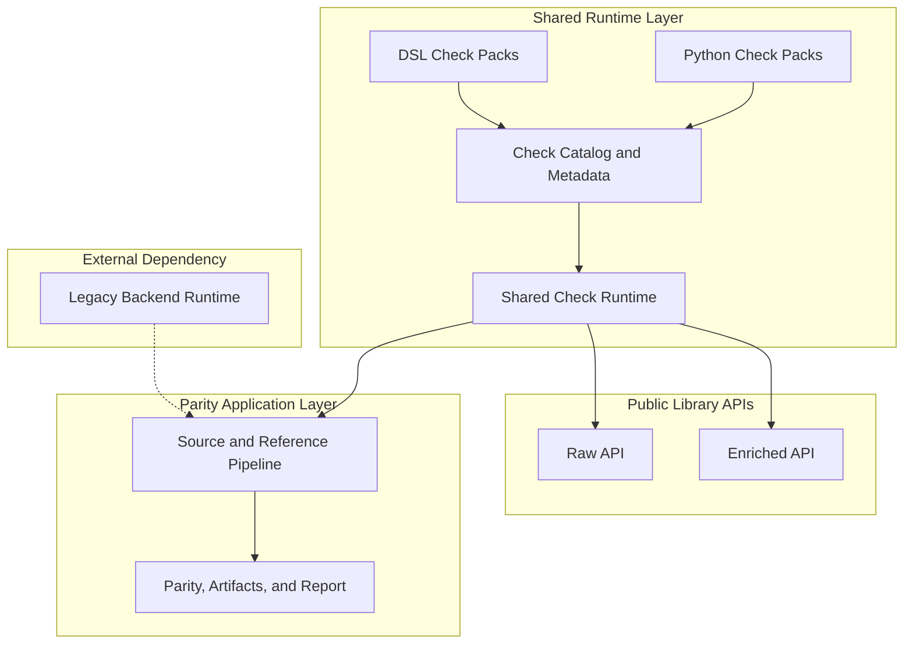

# OpenFoodFacts - Data Quality

Framework prototype for migrating Open Food Facts data quality checks from Perl to Python with parity validation against the legacy backend.

The repository combines three parts:

- a reusable Python library that packages migrated checks and new regional checks
- a parity application that compares migrated output with the current legacy backend
- migration-planning tooling that analyzes legacy Perl sources and produces review artifacts

## Purpose

Open Food Facts already has a large body of trusted data quality logic in the legacy backend. The migration also needs:

- a check runtime that can outlive the migration project
- a disciplined way to compare migrated behavior against the legacy backend
- artifacts that help reviewers understand what changed, what still mismatches, and what remains to migrate

The repository is the prototype for that workflow.

## Current Capabilities

- run a parity-backed demo and inspect the generated migration report
- execute the parity application locally against a DuckDB snapshot
- use the Python library directly on `raw_products` rows or explicit `enriched_products` snapshots
- author checks in Python or in the repository DSL
- generate legacy inventory artifacts to support migration planning

## Repository Layers

The diagram shows the main runtime-oriented layers and the most important dependency edges between them. The table below restates the same structure in text.



<table>
  <thead>
    <tr>
      <th>Layer</th>
      <th>Layer Description</th>
      <th>Block</th>
      <th>Block Description</th>
    </tr>
  </thead>
  <tbody>
    <tr>
      <td rowspan="4"><code>Shared Runtime Layer</code></td>
      <td rowspan="4">Defines the reusable check runtime used by the public library APIs and by the parity application.</td>
      <td><code>Python Check Packs</code></td>
      <td>Packaged Python-defined checks shipped with the shared runtime.</td>
    </tr>
    <tr>
      <td><code>DSL Check Packs</code></td>
      <td>Packaged DSL-defined checks shipped with the shared runtime.</td>
    </tr>
    <tr>
      <td><code>Check Catalog and Metadata</code></td>
      <td>Loads packaged checks and exposes the metadata used to select them by input surface, parity baseline, and jurisdiction.</td>
    </tr>
    <tr>
      <td><code>Shared Check Runtime</code></td>
      <td>Builds normalized contexts and executes selected checks for the raw and enriched input surfaces.</td>
    </tr>
    <tr>
      <td rowspan="2"><code>Public Library APIs</code></td>
      <td rowspan="2">Expose the shared runtime directly to Python callers without the parity-report application layer.</td>
      <td><code>Raw API</code></td>
      <td>Public entrypoint for running checks on raw public-product rows.</td>
    </tr>
    <tr>
      <td><code>Enriched API</code></td>
      <td>Public entrypoint for running checks on explicit enriched snapshots.</td>
    </tr>
    <tr>
      <td rowspan="2"><code>Parity Application Layer</code></td>
      <td rowspan="2">Builds on the shared runtime and adds reference loading, parity comparison, artifacts, and report rendering.</td>
      <td><code>Source and Reference Pipeline</code></td>
      <td>Loads source products, resolves reference-side data, and executes the migrated runtime for one run.</td>
    </tr>
    <tr>
      <td><code>Parity, Artifacts, and Report</code></td>
      <td>Compares reference and migrated findings, emits machine-readable artifacts, and renders the static report site.</td>
    </tr>
    <tr>
      <td><code>External Dependency</code></td>
      <td>The external Perl runtime used to produce reference results for parity-backed runs.</td>
      <td><code>Legacy Backend Runtime</code></td>
      <td>Materializes enriched snapshots and legacy-emitted finding tags for the parity application.</td>
    </tr>
  </tbody>
</table>

## Demo

For reviewers and mentors, the demo image is the quickest entrypoint. It requires Docker but does not require cloning the repository.

```bash
docker run --rm -p 8000:8000 ghcr.io/bobcorn/openfoodfacts-data-quality:demo
```

Then open [http://localhost:8000](http://localhost:8000).

The demo container:

- runs the parity application against the bundled DuckDB sample
- materializes reference results through the legacy backend runtime
- executes the migrated checks
- compares reference and migrated findings
- writes the HTML report and JSON artifacts
- serves the generated site locally

## Local Run

The normal local workflow for parity-backed development uses Docker.

```bash
git clone https://github.com/bobcorn/openfoodfacts-data-quality.git
cd openfoodfacts-data-quality
cp .env.example .env
docker compose up --build
```

Then open [http://localhost:8000](http://localhost:8000).

Key points:

- `.env` controls the local runtime inputs
- the starter configuration points to the tracked sample DuckDB snapshot
- generated outputs are written under `artifacts/latest/`
- reference results are cached across runs
- source code is not bind-mounted into the container, so code changes require a rebuild

For focused Python-only work outside Docker, create a local virtual environment and install `.[app,dev]`. The parity workflow itself is still best exercised through Docker because it provides the legacy backend runtime in a controlled environment.

## Library Usage

The public Python API is organized by input surface:

- `openfoodfacts_data_quality.raw`
- `openfoodfacts_data_quality.enriched`

Minimal raw-surface example:

```python
from openfoodfacts_data_quality import raw

findings = raw.run_checks(
    rows,
    check_ids=["en:serving-quantity-over-product-quantity"],
)
```

Use the `raw` surface for checks that can run directly from public-product rows. Use the `enriched` surface when a check depends on backend-derived data such as enriched flags, category properties, or richer nutrition structures.

## Current Status

The repository is public and usable today, but still a prototype.

What is already in good shape:

- the shared Python check runtime
- the packaged check catalog
- parity-backed execution for legacy-backed check sets
- static report and machine-readable artifacts
- migration-planning support around legacy inventory export

What is still intentionally provisional:

- the long-term boundary of the public enriched API
- full-corpus operational strategy
- the breadth of migrated legacy coverage
- report UX for non-parity runtime-only checks

The parity application is still coupled to the current legacy backend. That dependency is deliberate at this stage because strict comparison against trusted legacy behavior is part of the project goal.

## Documentation

Documentation lives under [`docs/`](docs/index.md).

Useful starting points:

- First look: [Project Overview and Scope](docs/project/overview-and-scope.md)
- Run the project: [Local Development](docs/guides/local-development.md)
- Understand the system: [System Overview](docs/architecture/system-overview.md)
- Understand the report and artifacts: [Reading The Report](docs/getting-started/reading-the-report.md)
- Use the library: [Library Usage](docs/guides/library-usage.md)
- Work on checks: [Authoring Checks](docs/guides/authoring-checks.md)
