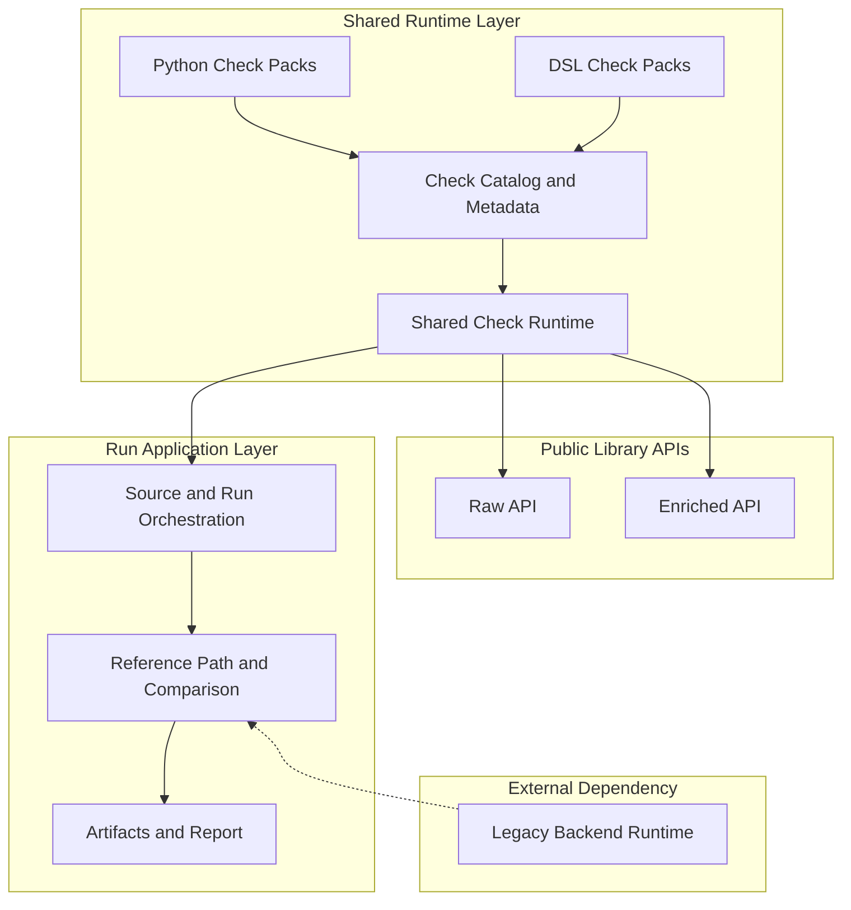

# Open Food Facts - Data Quality

Framework prototype for migrating Open Food Facts data quality checks from Perl to Python with parity validation against the legacy backend.

## Why this exists

Open Food Facts already relies on more than 200 data quality checks in the legacy Perl backend. This prototype explores a Python framework for migrating that logic, validating parity against the legacy backend, supporting Canada specific rules, and running the checks more easily in local DuckDB based workflows.

## Understand the layers



### Shared runtime layer

The shared runtime lives in `src/openfoodfacts_data_quality/`. It packages Python checks, DSL checks, catalog metadata, and the execution engine that builds [normalized contexts](docs/concepts/runtime-model.md#normalized-context) and emits findings.

### Public library APIs

The public library exposes `raw` and `enriched` entry points for Python callers that want findings without the application run layer.

### Application run layer

The application layer lives in `app/`. It loads source data, resolves reference results when a run needs them, applies strict comparison, and writes artifacts plus the static report.

### Legacy backend

Compared runs and enriched application runs still depend on the legacy backend for cache misses on the reference path. The Perl boundary emits a versioned envelope whose stable payload is [`ReferenceResult`](docs/reference/data-contracts.md#referenceresult).

## Run the demo

Run the demo to see the project in action immediately without cloning the repository.

### Before you begin

- Docker

### Start the demo

1. Run the demo image:

   ```bash
   docker run --rm -p 8000:8000 ghcr.io/bobcorn/openfoodfacts-data-quality:demo
   ```

2. Open [http://localhost:8000](http://localhost:8000).

### What the demo does

- Docker pulls and starts the published demo image.
- Inside the container, the application loads the bundled DuckDB [source snapshot](docs/reference/glossary.md#source-snapshot).
- The demo uses the [`full` check profile](docs/concepts/check-model.md#check-profiles), so it runs the shipped migrated checks for the main application flow.
- The run prepares [reference data](docs/concepts/reference-and-parity.md#reference-data) where needed, executes the migrated checks, and applies [strict comparison](docs/concepts/reference-and-parity.md#strict-comparison) to checks with `parity_baseline="legacy"`.
- The application writes the static report plus `run.json` and `snippets.json`, then serves the site on port `8000`.
- The first start can take longer because Docker has to pull the image and build the demo artifacts.

## Run the application locally

### Before you begin

- Docker
- a local checkout of this repository

### Start a local run

1. Clone the repository and enter the working tree.

   ```bash
   git clone https://github.com/bobcorn/openfoodfacts-data-quality.git
   cd openfoodfacts-data-quality
   ```

2. Create the local environment file.

   ```bash
   cp .env.example .env
   ```

3. Build and start the application.

   ```bash
   docker compose up --build
   ```

4. Open [http://localhost:8000](http://localhost:8000).

### What this flow uses

- `.env` points to the tracked sample DuckDB snapshot by default.
- The default [`full` check profile](docs/concepts/check-model.md#check-profiles) runs compared checks and runtime only checks in the same run.
- Outputs are written under [`artifacts/latest/`](docs/reference/run-configuration-and-artifacts.md).
- The [reference cache](docs/reference/run-configuration-and-artifacts.md#reference-cache) is reused across runs.
- Docker Compose does not mount the source tree into the container, so code changes require another `docker compose up --build`.

## Set up Python tooling

Use a local `.venv` for tests, linting, typing, and repository utilities.

1. Create the virtual environment.

   ```bash
   python3.14 -m venv .venv
   ```

2. Install the repository with app and dev dependencies.

   ```bash
   .venv/bin/python -m pip install -e ".[app,dev]"
   ```

Keep Docker for compared runs, enriched application runs, report rendering, and local preview.

## Use the library

The public Python API exposes two [input surfaces](docs/reference/data-contracts.md#input-surfaces):

- `openfoodfacts_data_quality.raw`
- `openfoodfacts_data_quality.enriched`

Run raw checks when the rule depends only on public product rows:

```python
from openfoodfacts_data_quality import raw

findings = raw.run_checks(
    rows,
    check_ids=["en:serving-quantity-over-product-quantity"],
)
```

Use `enriched` when a check depends on stable enriched data such as flags, category properties, or richer nutrition structures. In application runs, that data usually comes from the [reference path](docs/concepts/reference-and-parity.md#reference-path). In direct library usage, callers provide it explicitly as [enriched snapshots](docs/reference/data-contracts.md#enriched-snapshot).

## Read the documentation

For more details, check the [documentation](docs/index.md).
