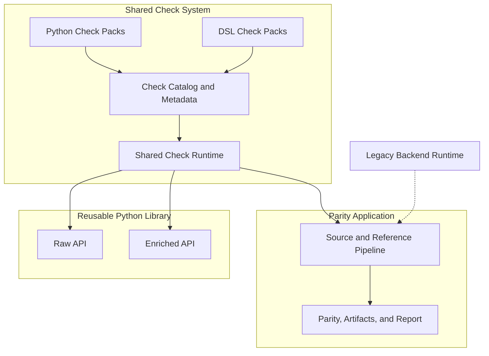

# Open Food Facts - Data Quality

Prototype for migrating Open Food Facts data quality checks from Perl to Python.

The repository combines:

- a reusable Python library that packages migrated and newly defined regional checks
- a parity application that compares migrated output with the legacy backend
- operational tooling for migration planning and review

## Project Overview



<table>
  <thead>
    <tr>
      <th>Surface</th>
      <th>Surface Description</th>
      <th>Block</th>
      <th>Block Description</th>
    </tr>
  </thead>
  <tbody>
    <tr>
      <td rowspan="4"><code>Shared Check System</code></td>
      <td rowspan="4">Defines the shared check system used by the reusable library and the parity application.</td>
      <td><code>Python Check Packs</code></td>
      <td>Packaged Python-defined checks shipped under the reusable library surface.</td>
    </tr>
    <tr>
      <td><code>DSL Check Packs</code></td>
      <td>Packaged DSL-defined checks shipped under the reusable library surface.</td>
    </tr>
    <tr>
      <td><code>Check Catalog and Metadata</code></td>
      <td>Loads the packaged checks and exposes the metadata used to select them by input surface, parity baseline, and jurisdiction.</td>
    </tr>
    <tr>
      <td><code>Shared Check Runtime</code></td>
      <td>Provides the runtime used to build contexts and execute checks for the two top-level surfaces.</td>
    </tr>
    <tr>
      <td rowspan="2"><code>Reusable Python Library</code></td>
      <td rowspan="2">Exposes the shared check runtime directly to Python callers without the parity/report application layer.</td>
      <td><code>Raw API</code></td>
      <td>Public library entrypoints for running checks on raw public-product rows.</td>
    </tr>
    <tr>
      <td><code>Enriched API</code></td>
      <td>Public library entrypoints for running checks on explicit enriched snapshots.</td>
    </tr>
    <tr>
      <td rowspan="2"><code>Parity Application</code></td>
      <td rowspan="2">Builds on top of the shared runtime. Adds the reference path, parity evaluation, and report artifacts.</td>
      <td><code>Source and Reference Pipeline</code></td>
      <td>Loads source products, resolves reference-side data, and executes the migrated runtime for one run.</td>
    </tr>
    <tr>
      <td><code>Parity, Artifacts, and Report</code></td>
      <td>Compares reference and migrated output, emits machine-readable artifacts, and renders the report site.</td>
    </tr>
    <tr>
      <td><code>External Dependency</code></td>
      <td>The external Perl runtime used to produce reference results for parity-backed runs.</td>
      <td><code>Legacy Backend Runtime</code></td>
      <td>External Perl backend used by the parity application when reference results must be materialized.</td>
    </tr>
  </tbody>
</table>

## Demo

For reviewers and mentors, the demo container is the fastest entrypoint. It only requires Docker and does not require cloning the repository.

To run the demo, execute:

```bash
docker run --rm -p 8000:8000 ghcr.io/bobcorn/openfoodfacts-data-quality:demo
```

The command:

- pulls the demo image from GHCR
- runs the parity app against the bundled DuckDB sample
- reads source products in batches
- resolves reference results
- executes the migrated checks
- compares the reference and migrated outputs
- writes the report and JSON artifacts in the container
- serves the final report at [http://localhost:8000](http://localhost:8000)

## Development

For local development:

```bash
git clone https://github.com/bobcorn/openfoodfacts-data-quality.git
cd openfoodfacts-data-quality
```

Create the local `.env` file:

```bash
cp .env.example .env
```

`.env` holds the local runtime settings. The starter file points to the tracked sample DuckDB.

Build and start the app:

```bash
docker compose up --build
```

Verify the setup at [http://localhost:8000](http://localhost:8000). If the report loads, the local setup is working.

Code changes require a new Docker Compose build because the source tree is not bind-mounted.

## Documentation

To explore the technical details, see the [project documentation](docs/index.md).
