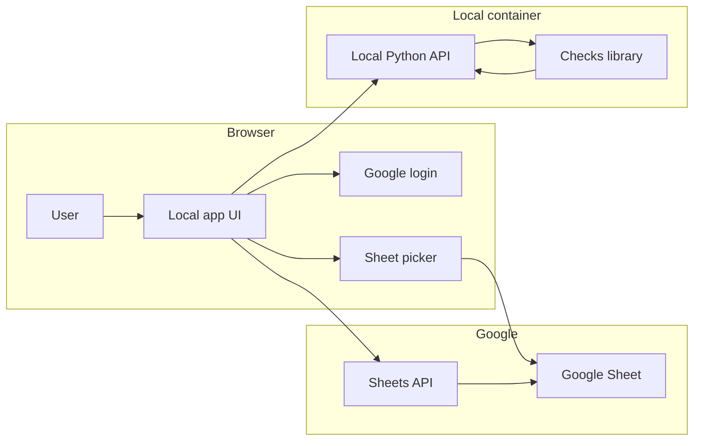

# Google Sheets Demo

This is a small local web demo packaged as one Docker image.

The browser owns the Google login and talks to Google Sheets directly. The
Python server stays focused on CSV parsing and data quality checks. Cleanup
steps that touch only the sheet stay in the browser to keep round trips small.



The demo is packaged as one local image and uses the same Python library that a
separate deployment would install.

## Scope

This MVP uses CSV input.

The upload step expects the Open Food Facts food CSV export from the official
[data page](https://world.openfoodfacts.org/data). When you choose a file, the
app shows how many library-supported columns it includes. Missing the required
`code` column is an error.

Included flows:

- load a CSV file into the `Data` Google Sheets tab
- validate the `Data` Google Sheets tab with the public Python checks API
- clear derived validation output
- prepare a `Ready for OFF upload` sheet with only passing rows
- show a placeholder for the future Open Food Facts upload step

## Layout

- `server.py`: tiny Python HTTP server
- `api.py`: JSON endpoints and payload shaping
- `data_sources.py`: CSV ingestion
- `workflow.py`: validation and sheet transformation logic
- `templates/`: Jinja entry template for the app
- `static/`: CSS and browser code for Sheets integration
- `Dockerfile` and `compose.yaml`: local app packaging

## Authentication model

The page uses Google Identity Services for login and Google Picker for file
selection.

The image carries the Google OAuth client ID, the Google Picker API key, and
the Google Cloud project number for the app. The browser uses those values for
Google Identity Services login and Google Picker file selection.

Those values are public app identifiers, not private backend secrets. A public
image must still keep the API key restricted to localhost referrers and the
Picker API, and it should use a dedicated Google Cloud project because quota is
shared across every user of the image.

The access model is intentionally narrower than the earlier URL-based version:

- Google Picker selects the spreadsheet from Drive
- the browser requests the `drive.file` scope
- the app then reads and writes the chosen spreadsheet through the Google
  Sheets API

The end user does not provide any JSON file, secret, or environment variable.
There is no client secret in this runtime design.

## Maintainer setup

To build a distributable image, configure the Google app once:

1. Create a Google Cloud project.
2. Enable `Google Sheets API`.
3. Enable `Google Picker API`.
4. Create an OAuth client for a Web application.
5. Add `http://localhost` and `http://localhost:8501` as authorized JavaScript
   origins.
6. Create an API key for Google Picker.
7. Restrict the API key to the Picker API and localhost referrers.
8. Note the Google Cloud project number.
9. If you publish from GitHub Actions, add these repository secrets:
   - `GOOGLE_SHEETS_CLIENT_ID`
   - `GOOGLE_SHEETS_API_KEY`
   - `GOOGLE_SHEETS_CLOUD_PROJECT_NUMBER`
10. Build the image with:
   - `GOOGLE_SHEETS_CLIENT_ID`
   - `GOOGLE_SHEETS_API_KEY`
   - `GOOGLE_SHEETS_CLOUD_PROJECT_NUMBER`

This setup is much lighter than a `spreadsheets`-scope app that works from an
arbitrary pasted URL. With `drive.file` and Picker, the app can usually stay
outside the heavier sensitive-scope verification path.

## Run it

Run the published demo image:

```bash
docker run --rm -p 127.0.0.1:8501:8501 ghcr.io/bobcorn/google-sheets-demo
```

Then open [http://localhost:8501](http://localhost:8501).

This demo image is produced by
`.github/workflows/publish-google-sheets-demo-image.yml`. Versioned releases
also publish tags such as `1.2.3`.

The migration demo image stays separate in `ghcr.io/bobcorn/migration-demo`.

For a local build with Compose:

```bash
cp .env.example .env
cd apps/google_sheets
docker compose up --build
```

By default the Compose file binds the app only to `127.0.0.1`, not the whole
local network.

Compose builds the same demo image locally and tags it as
`google-sheets-demo:local`.

To build one distributable image locally with the Google client ID baked in:

```bash
/Users/marco/Development/openfoodfacts-data-quality/apps/google_sheets/build_image.sh \
  your-client-id.apps.googleusercontent.com \
  your-google-picker-api-key \
  your-google-cloud-project-number
```

## Before the walkthrough

1. Create or choose a Google Sheet.
2. Click `Connect Google`.
3. Click `Choose spreadsheet`.
4. Pick the file from Google Drive.
5. If the sheet already has data, skip the CSV upload step.
6. If you want to start from local data, upload a CSV file from the page.

## Suggested walkthrough

1. Click `Connect Google`.
2. Click `Choose spreadsheet`.
3. Pick the file from Google Drive.
4. Upload the CSV into the `Data` Google Sheets tab, if needed.
5. Click `Validate data`.
6. Show the derived `dq_*` columns and row highlighting in the `Data` Google Sheets tab.
7. Open the selected sheet in Google Sheets and fix a few rows.
8. Click `Validate data` again.
9. Click `Prepare upload candidates`.
10. Show `Ready for OFF upload`.
11. Click `Upload to Open Food Facts` and show that the final integration is still pending.

## Environment variables

For local Compose builds, `.env` only carries optional builder settings:

- `GOOGLE_SHEETS_BIND_HOST`
- `GOOGLE_SHEETS_PORT`
- `GOOGLE_SHEETS_CLIENT_ID`
- `GOOGLE_SHEETS_API_KEY`
- `GOOGLE_SHEETS_CLOUD_PROJECT_NUMBER`

End users do not need any environment variables if they run a prebuilt image.

## Why Docker builds a wheel

The image builds and installs the packaged library wheel first, then layers the
Google Sheets app on top of it. That keeps the packaged runtime close to a
separate deployment.
