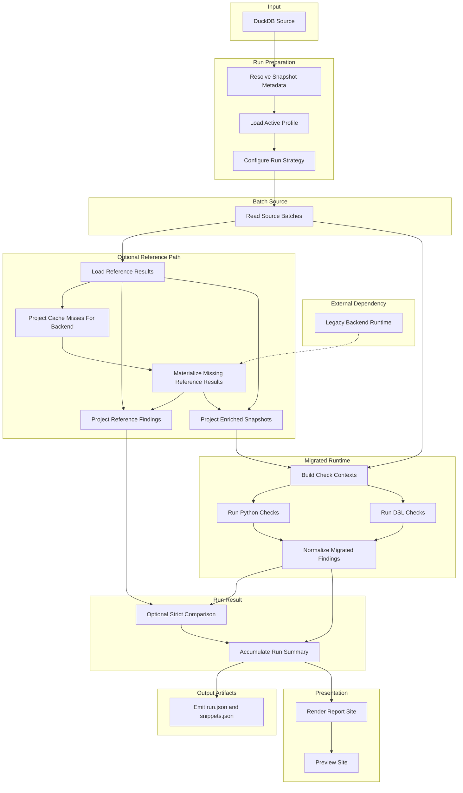

# Application Run Flow

[Documentation](../index.md) / [Architecture](index.md) / Application Run Flow

One application run from source snapshot to rendered report.

## Flow Overview

The table below restates the same flow stage by stage.

| Stage | Nodes In The Diagram | Role In The Flow |
| --- | --- | --- |
| Input | DuckDB Source | Provides the source snapshot consumed by the run. |
| Run preparation | Resolve Snapshot Metadata, Load Active Profile, Configure Run Strategy | Determines the source snapshot id, selected checks, required input surface, and whether reference data is needed. |
| Batch source | Read Source Batches | Streams ordered source rows from DuckDB. |
| External dependency | Legacy Backend Runtime | Executes the trusted Perl boundary that materializes enriched reference data and legacy finding tags. |
| Optional reference path | Load Reference Results, Project Cache Misses For Backend, Materialize Missing Reference Results, Project Reference Findings, Project Enriched Snapshots | Reuses cache when possible, projects only cache misses into the explicit backend input contract, materializes missing results through the legacy backend, and then projects the resulting reference records onto parity findings and enriched snapshots. |
| Migrated runtime | Build Check Contexts, Run Python Checks, Run DSL Checks, Normalize Migrated Findings | Builds normalized contexts, executes the selected migrated checks, and turns the results into comparable findings. |
| Run result | Optional Strict Comparison, Accumulate Run Summary | Applies strict multiset comparison where a legacy baseline exists and aggregates all checks into one run result. |
| Output artifacts | Emit run.json and snippets.json | Writes the JSON outputs used for inspection and downstream review. |
| Presentation | Render Report Site, Preview Site | Builds the static report site and serves it locally for review. |

## Run Preparation

The run layer resolves:

- the source snapshot id
- the active check profile
- the required input surface
- whether reference results are needed at all
- the reference cache location when the selected checks need reference results

The source snapshot id comes from `SOURCE_SNAPSHOT_ID` when set, then from a `<name>.duckdb.snapshot.json` sidecar, then from a file hash fallback that writes that sidecar for later runs.

The active profile determines the check set, input surface, and parity baselines in scope.

The shipped profiles can mix compared and runtime only checks in one run when the selected metadata calls for both baselines.

## Source Batches

Source rows are streamed from DuckDB in ordered batches. The same source reader contract is used for the bundled sample and for larger snapshots that follow the same schema.

## Reference Path

If the run needs reference findings or enriched snapshots:

- `ReferenceResultLoader` returns one ordered `ReferenceResult` list for the batch
- cached reference results are reused when possible
- only cache misses are projected into the explicit legacy backend input contract
- only cache misses are materialized through persistent legacy backend workers
- the migrated runtime reads enriched snapshots through `EnrichedSnapshotMaterializer`
- strict comparison reads reference findings through `ReferenceFindingMaterializer`

If the run does not need reference data, this branch is skipped.

## Legacy Backend

Compared runs still compare migrated output against the behavior of the current trusted backend.

For that reason the reference path still depends on the current backend runtime for cache misses. The Perl wrapper emits a versioned result envelope with `contract_kind`, `contract_version`, and a stable `reference_result` payload. Python validates that envelope before the batch uses the resulting `ReferenceResult`.

That includes compared `raw_products` runs. Even when migrated contexts are built from raw rows, the reference side still comes from legacy emitted tags. Only runs that need no reference results can skip the reference path entirely. Compared and enriched runs can still avoid live backend execution when the cache already covers the requested products. See [Legacy Backend Image](../operations/legacy-backend-image.md).

## Migrated Contexts

The migrated runtime builds normalized contexts from:

- raw rows for `raw_products`
- enriched snapshots for `enriched_products`

That keeps the execution engine independent from source specific shapes.

## Check Execution

The shared execution engine loads the selected evaluators and runs them on the normalized contexts. Python and DSL checks are executed through one unified path.

## Strict Comparison

The comparison layer normalizes reference and migrated outputs into observed findings and compares them with strict multiset equality over:

- product id
- observed code
- severity

This comparison is stricter than matching on check id alone.

Checks with `parity_baseline="none"` do not enter this step. They still contribute findings and counts to the run result with `comparison_status="runtime_only"`.

## Run Result

Batch level results are accumulated into one `RunResult`.

Each active check contributes one `RunCheckResult`. Compared checks carry match, missing, and extra counts. Runtime only checks carry migrated findings without a reference side comparison.

## Outputs

The completed run produces:

- a static HTML report
- `run.json`
- `snippets.json`
- a bundled JSON export archive
- `legacy-backend-stderr.log` when the backend worker starts and emits stderr

`run.json` and `snippets.json` both include root `kind` and `schema_version` metadata.
`snippets.json` also records `legacy_snippet_status` on each check, so runtime only checks and unavailable legacy provenance are distinguishable without parsing HTML.

The report supports both compared and runtime only checks. Strict comparison metrics only apply to the compared subset. The shipped `full` profile exercises both modes together.

## Next Reads

- [Reading The Report](../getting-started/reading-the-report.md)
- [Configuration and Artifacts](../operations/configuration-and-artifacts.md)
- [Legacy Backend Image](../operations/legacy-backend-image.md)
- [System Overview](system-overview.md)
