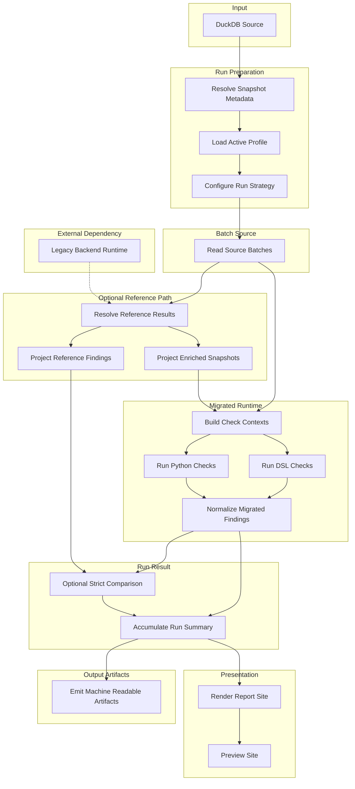

# Application Run Flow

[Documentation](../index.md) / [Architecture](index.md) / Application Run Flow

One application run from source snapshot to rendered report.

## Flow Overview

<table>
  <thead>
    <tr>
      <th>Stage</th>
      <th>Stage Description</th>
      <th>Node</th>
      <th>Node Description</th>
    </tr>
  </thead>
  <tbody>
    <tr>
      <td><code>Input</code></td>
      <td>Provides the source snapshot consumed by the run.</td>
      <td><code>DuckDB Source</code></td>
      <td>Holds the ordered product rows used for the run.</td>
    </tr>
    <tr>
      <td rowspan="3"><code>Run Preparation</code></td>
      <td rowspan="3">Determines the run inputs, selected checks, and whether reference results are needed.</td>
      <td><code>Resolve Snapshot Metadata</code></td>
      <td>Resolves the source snapshot id from an env override, a sidecar file, or a file hash fallback.</td>
    </tr>
    <tr>
      <td><code>Load Active Profile</code></td>
      <td>Loads the selected check profile and its active metadata filters.</td>
    </tr>
    <tr>
      <td><code>Configure Run Strategy</code></td>
      <td>Decides the required input surface, reference requirements, and runtime strategy for the run.</td>
    </tr>
    <tr>
      <td><code>Batch Source</code></td>
      <td>Streams ordered source rows in batches.</td>
      <td><code>Read Source Batches</code></td>
      <td>Reads one ordered batch from DuckDB.</td>
    </tr>
    <tr>
      <td><code>External Dependency</code></td>
      <td>Supplies backend generated reference data when the reference path needs live materialization.</td>
      <td><code>Legacy Backend Runtime</code></td>
      <td>Emits the versioned backend result envelope that carries <code>ReferenceResult</code>.</td>
    </tr>
    <tr>
      <td rowspan="3"><code>Optional Reference Path</code></td>
      <td rowspan="3">Builds the ordered reference result list for the batch, then projects it onto the inputs used by parity and enriched runs.</td>
      <td><code>Resolve Reference Results</code></td>
      <td>Loads reference results for the batch through cache reuse and backend materialization when needed.</td>
    </tr>
    <tr>
      <td><code>Project Reference Findings</code></td>
      <td>Builds normalized reference findings for strict comparison.</td>
    </tr>
    <tr>
      <td><code>Project Enriched Snapshots</code></td>
      <td>Builds stable enriched snapshots for the migrated runtime.</td>
    </tr>
    <tr>
      <td rowspan="4"><code>Migrated Runtime</code></td>
      <td rowspan="4">Builds normalized contexts, runs the selected checks, and turns their output into comparable migrated findings.</td>
      <td><code>Build Check Contexts</code></td>
      <td>Builds normalized contexts from raw rows or enriched snapshots.</td>
    </tr>
    <tr>
      <td><code>Run Python Checks</code></td>
      <td>Executes the selected Python evaluators.</td>
    </tr>
    <tr>
      <td><code>Run DSL Checks</code></td>
      <td>Executes the selected DSL evaluators.</td>
    </tr>
    <tr>
      <td><code>Normalize Migrated Findings</code></td>
      <td>Converts evaluator output into normalized migrated findings.</td>
    </tr>
    <tr>
      <td rowspan="2"><code>Run Result</code></td>
      <td rowspan="2">Builds the batch level comparison and accumulates the final run summary.</td>
      <td><code>Optional Strict Comparison</code></td>
      <td>Applies strict multiset comparison where a legacy baseline exists.</td>
    </tr>
    <tr>
      <td><code>Accumulate Run Summary</code></td>
      <td>Aggregates batch results into one <code>RunResult</code>.</td>
    </tr>
    <tr>
      <td><code>Output Artifacts</code></td>
      <td>Writes machine readable outputs for review and downstream use.</td>
      <td><code>Emit Machine Readable Artifacts</code></td>
      <td>Writes <code>run.json</code>, <code>snippets.json</code>, and the bundled export archive.</td>
    </tr>
    <tr>
      <td rowspan="2"><code>Presentation</code></td>
      <td rowspan="2">Builds the report site and serves it locally.</td>
      <td><code>Render Report Site</code></td>
      <td>Builds the static review site from the completed run result.</td>
    </tr>
    <tr>
      <td><code>Preview Site</code></td>
      <td>Serves the generated site for local review.</td>
    </tr>
  </tbody>
</table>

## Run Preparation

The run layer resolves:

- the source snapshot id
- the active check profile
- the required input surface
- whether reference results are needed at all
- the reference cache location when the selected checks need reference results

The source snapshot id comes from `SOURCE_SNAPSHOT_ID` when set, then from a `<name>.duckdb.snapshot.json` sidecar, then from a file hash fallback that writes that sidecar for later runs.

The active profile determines the check set, input surface, and parity baselines in scope.

The shipped profiles can mix compared and runtime only checks in one run when the selected metadata calls for both baselines.

## Source Batches

Source rows are streamed from DuckDB in ordered batches. The same source reader contract is used for the bundled sample and for larger snapshots that follow the same schema.

## Reference Path

If the run needs reference findings or enriched snapshots:

- `ReferenceResultLoader` returns one ordered `ReferenceResult` list for the batch
- cached reference results are reused when possible
- only cache misses are projected into the explicit legacy backend input contract
- only cache misses are materialized through persistent legacy backend workers
- the migrated runtime reads enriched snapshots through `EnrichedSnapshotMaterializer`
- strict comparison reads reference findings through `ReferenceFindingMaterializer`

If the run does not need reference data, this branch is skipped.

## Legacy Backend

Compared runs still compare migrated output against the behavior of the current trusted backend.

For that reason the reference path still depends on the current backend runtime for cache misses. The Perl wrapper emits a versioned result envelope with `contract_kind`, `contract_version`, and a stable `reference_result` payload. Python validates that envelope before the batch uses the resulting `ReferenceResult`.

That includes compared `raw_products` runs. Even when migrated contexts are built from raw rows, the reference side still comes from legacy emitted tags. Only runs that need no reference results can skip the reference path entirely. Compared and enriched runs can still avoid live backend execution when the cache already covers the requested products. See [Legacy Backend Image](../operations/legacy-backend-image.md).

## Migrated Contexts

The migrated runtime builds normalized contexts from:

- raw rows for `raw_products`
- enriched snapshots for `enriched_products`

That keeps the execution engine independent from source specific shapes.

## Check Execution

The shared execution engine loads the selected evaluators and runs them on the normalized contexts. Python and DSL checks are executed through one unified path.

## Strict Comparison

The comparison layer normalizes reference and migrated outputs into observed findings and compares them with strict multiset equality over:

- product id
- observed code
- severity

This comparison is stricter than matching on check id alone.

Checks with `parity_baseline="none"` do not enter this step. They still contribute findings and counts to the run result with `comparison_status="runtime_only"`.

## Run Result

Batch level results are accumulated into one `RunResult`.

Each active check contributes one `RunCheckResult`. Compared checks carry match, missing, and extra counts. Runtime only checks carry migrated findings without a reference side comparison.

## Outputs

The completed run produces:

- a static HTML report
- `run.json`
- `snippets.json`
- a bundled JSON export archive
- `legacy-backend-stderr.log` when the backend worker starts and emits stderr

`run.json` and `snippets.json` both include root `kind` and `schema_version` metadata.
`snippets.json` also records `legacy_snippet_status` on each check, so runtime only checks and unavailable legacy provenance are distinguishable without parsing HTML.

The report supports both compared and runtime only checks. Strict comparison metrics only apply to the compared subset. The shipped `full` profile exercises both modes together.

## Next Reads

- [Reading The Report](../getting-started/reading-the-report.md)
- [Configuration and Artifacts](../operations/configuration-and-artifacts.md)
- [Legacy Backend Image](../operations/legacy-backend-image.md)
- [System Overview](system-overview.md)
