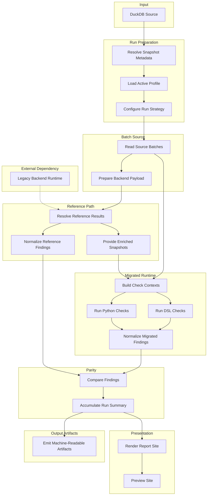

# Parity Pipeline

[Documentation](../index.md) / [Architecture](index.md) / Parity Pipeline

This is the application flow from one source snapshot to one report.

## Pipeline Overview

## 1. Prepare The Run

The pipeline resolves:

- the source snapshot id
- the active check profile
- the required input surface
- whether reference results are needed at all

## 2. Read Source Batches

Source rows are streamed from DuckDB in ordered batches. This uses the same pipeline on both the bundled sample and larger snapshots.

## 3. Resolve Reference Results When Needed

If the run needs parity-backed findings or enriched snapshots:

- raw rows are projected into the explicit legacy backend input contract
- cached reference results are reused when possible
- missing results are materialized through persistent legacy backend workers

If the run does not need reference-side data, this branch is skipped.

## Legacy Backend Dependency

Parity-backed runs compare migrated output against artifacts produced by the current legacy backend.

For that reason the pipeline still materializes:

- enriched snapshots from the legacy side
- legacy-emitted check tags from the legacy side

The containerized runtime makes this dependency reproducible across local and CI runs.

## 4. Build Migrated Contexts

The migrated runtime builds normalized contexts from:

- raw rows for `raw_products`
- enriched snapshots for `enriched_products`

## 5. Run The Selected Checks

The shared execution engine runs the selected Python and DSL evaluators and emits migrated findings.

## 6. Compare Reference And Migrated Output

The parity layer normalizes both sides into observed findings and compares them with strict multiset equality over:

- product id
- observed code
- severity

## 7. Emit Artifacts

The completed run produces:

- a static HTML report
- `parity.json`
- `snippets.json`
- a JSON export archive

The report emphasizes exact totals and bounded examples rather than embedding every finding.

[Back to Architecture](index.md) | [Back to Documentation](../index.md)
