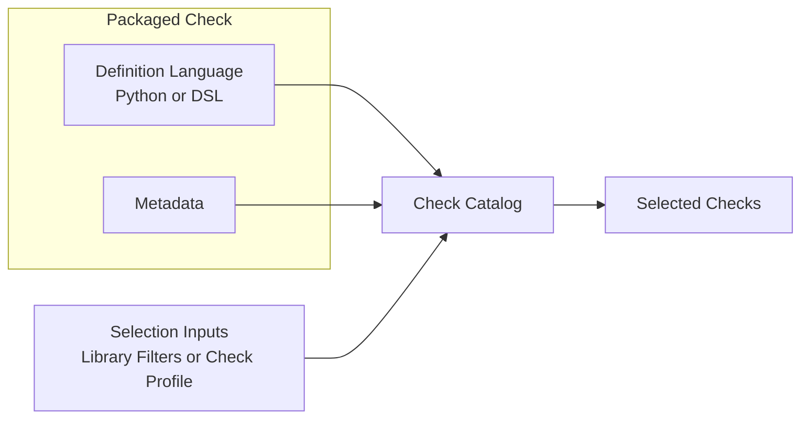

# What a Migrated Check Contains

[Back to documentation](../index.md)

A migrated check includes evaluator logic plus metadata that controls selection, execution, and [parity](reference-and-parity.md).

## Packaged Checks

Checks are packaged repository content under `src/openfoodfacts_data_quality/checks/`.

A packaged check includes evaluator logic plus the metadata that tells the runtime where the rule can run and how it should be selected.

The catalog loads packaged checks for library calls and application runs. A check hidden inside `app/` would bypass the [shared runtime](runtime-model.md#shared-runtime) and exist only for one orchestration path.

## DSL and Python

Each check uses one definition language: Python or the repository DSL.

### Definition Languages

The repository DSL is a small declarative language written in YAML for rules that fit cleanly on approved [normalized context](runtime-model.md#normalized-context) fields.

A DSL check describes a condition and the finding that condition should emit.

Python checks are ordinary repository code. They receive the same runtime context and emit findings through the same contracts.

### Language Fit

Use the DSL when the rule is a direct boolean statement over approved [normalized context](runtime-model.md#normalized-context) paths and one static severity is enough.

Use Python when the rule needs:

- loops or aggregation
- logic that depends on helpers
- richer numeric reasoning
- dynamic emitted codes

Once loaded, Python and DSL checks share the same metadata model, selection model, and execution path.

## Metadata

Metadata is the structured information attached to a check definition.

The evaluator says what finding to emit. The metadata says where the check can run, how the runtime selects it, and whether it participates in [parity](reference-and-parity.md).

### Fields

- `supported_input_surfaces`
  [runtime surfaces](runtime-model.md#input-surfaces) that can execute the check
- `required_context_paths`
  stable dotted fields inside [NormalizedContext](runtime-model.md#normalized-context) that the check depends on
- [`parity_baseline`](reference-and-parity.md#parity-baseline)
  whether the check participates in [strict comparison](reference-and-parity.md#strict-comparison)
- `jurisdictions`
  markets where the check is eligible
- `legacy_identity`
  explicit mapping to the correct legacy emitted code template when the default mapping is not enough

Selection, validation, parity, and reporting all depend on this metadata.

The exact metadata fields and selection inputs are listed in [Check Metadata and Selection](../reference/check-metadata-and-selection.md).

## Check Profiles

A check profile is a named application preset from `config/check-profiles.toml`.

Profiles do not define checks. They select a run from the checks that already exist in the packaged catalog.

Profiles apply metadata filters such as [input surface](runtime-model.md#input-surfaces) and [parity baseline](reference-and-parity.md#parity-baseline). A focused profile can also narrow execution to one small workset without changing the underlying definitions.

## Model Role

The check model keeps rule logic, rule metadata, and run selection explicit.

That separation lets the repository support reusable library execution, [application runs](runtime-model.md#application-run-layer), [parity comparison](reference-and-parity.md#strict-comparison), checks that run without comparison, and short local validation loops without redefining checks for each environment.

[Back to documentation](../index.md)
