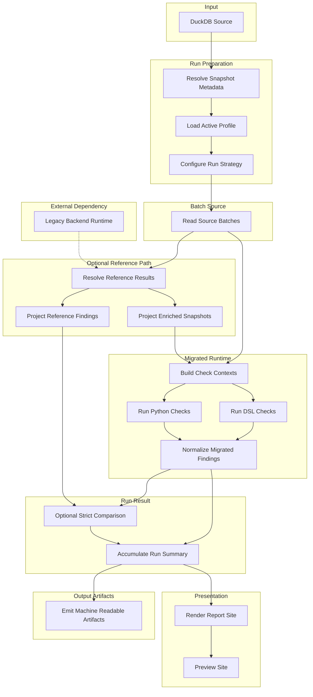

# How an Application Run Works

[Back to documentation](../index.md)

One [application run](../reference/glossary.md#runs) starts from DuckDB input and ends with [report output](../reference/report-artifacts.md).

## Overview

One run moves through these stages:

1. Resolve snapshot metadata, load the active profile, and choose the run strategy.
2. Stream ordered source batches from DuckDB.
3. Resolve [reference results](reference-and-parity.md#reference-path) when the selected checks need reference findings or enriched snapshots.
4. Build normalized contexts and run the selected Python plus DSL checks.
5. Apply strict comparison for checks with a [legacy baseline](reference-and-parity.md#parity-baseline).
6. Accumulate batch results into [`RunResult`](../reference/data-contracts.md#runresult).
7. Write JSON artifacts, render the report, and serve the preview site.

## Run Preparation

The run layer resolves:

- the source snapshot id
- the active [check profile](check-model.md#check-profiles)
- the required [input surface](runtime-model.md#input-surfaces)
- whether [reference results](reference-and-parity.md#reference-path) are needed
- the reference cache location when the selected checks need reference data

The source snapshot id comes from `SOURCE_SNAPSHOT_ID` when set, then from a `<name>.duckdb.snapshot.json` sidecar, then from a file hash fallback that writes the sidecar for later runs.

## Source Batches

Source rows are streamed from DuckDB in ordered batches. The same reader contract is used for the bundled sample and for larger snapshots that follow the same schema.

## Reference Path

If the run needs reference findings or enriched snapshots:

- `ReferenceResultLoader` returns one ordered [`ReferenceResult`](../reference/data-contracts.md#referenceresult) list for the batch
- cached reference results are reused when possible
- only cache misses are projected into the explicit legacy backend input contract
- only cache misses are materialized through persistent legacy backend workers
- `EnrichedSnapshotMaterializer` projects enriched snapshots for the migrated runtime
- `ReferenceFindingMaterializer` projects normalized reference findings for strict comparison

If the run does not need reference data, this branch is skipped.

## Legacy Backend

Compared runs still compare migrated output against the current trusted backend.

For cache misses, the reference path calls the Perl wrapper. The wrapper emits a versioned result envelope with `contract_kind`, `contract_version`, and a stable `reference_result` payload. Python validates that envelope before the batch uses [`ReferenceResult`](../reference/data-contracts.md#referenceresult).

Compared `raw_products` runs still need this path for reference findings. Only runs that need no reference results can skip it entirely.

## Context Building

The migrated runtime builds [normalized contexts](runtime-model.md#normalized-context) from:

- raw rows for `raw_products`
- enriched snapshots for `enriched_products`

That keeps the execution engine independent from shapes tied to one source.

## Execution

The shared engine loads the selected evaluators and runs them on normalized contexts. Python and DSL checks use one execution path.

## Strict Comparison

The comparison layer normalizes reference and migrated outputs into observed findings and compares them with strict multiset equality over:

- product id
- observed code
- severity

Checks with [`parity_baseline="none"`](reference-and-parity.md#parity-baseline) skip this step and still contribute findings plus counts to the run result with `comparison_status="runtime_only"`.

## Run Result

Results from each batch accumulate into one `RunResult`.

Each active check contributes one [`RunCheckResult`](../reference/data-contracts.md#runcheckresult). Compared checks carry match counts and mismatch counts. Checks that run without comparison carry migrated findings without a comparison against the reference side.

## Outputs

The completed run produces:

- a static HTML report
- [`run.json`](../reference/report-artifacts.md#runjson)
- [`snippets.json`](../reference/report-artifacts.md#snippetsjson)
- a bundled JSON export archive
- `legacy-backend-stderr.log` when the backend worker starts and emits stderr

`run.json` and `snippets.json` include root `kind` and `schema_version` metadata.

`snippets.json` also records `legacy_snippet_status` on each check, so checks that run without comparison and unavailable legacy provenance stay distinguishable without parsing HTML.

[Back to documentation](../index.md)
