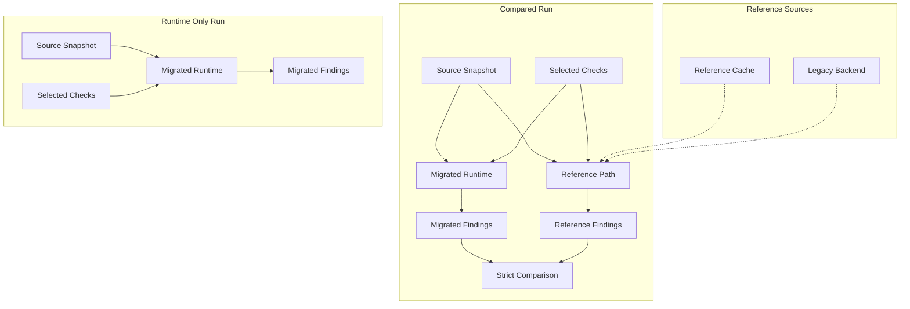

# Why Compared Runs Load Reference Data

[Back to documentation](../index.md)

Compared runs still load data from the legacy side for strict comparison.

In this repository, parity means exact comparison with legacy behavior when a check declares that expectation in its [metadata](check-model.md#metadata).

## Reference Data

Use `reference` for parity runtime data. Use `legacy backend` for the Perl execution boundary.

The legacy backend may produce the data, but the runtime owns the contract it consumes. Python validates the backend envelope and then works with [`ReferenceResult`](../reference/data-contracts.md#referenceresult).

## Reference Path

The reference path is the flow in the application that resolves the data needed for one run or one batch.

It exists because:

- compared checks need reference findings for strict comparison
- enriched application runs need [enriched snapshots](../reference/data-contracts.md#enriched-snapshot)

### Cache

The reference path checks the cache first. On a cache hit, the run reuses an existing [`ReferenceResult`](../reference/data-contracts.md#referenceresult). On a cache miss, the application projects the needed input into the legacy backend boundary, materializes a backend result, validates it, and stores the resulting reference payload in the cache namespace for that run contract.

### Raw Compared Runs

Compared raw runs still need the reference path. The migrated side may build its context from raw rows, but the comparison still needs reference findings from the reference contract.

> Note
> `raw_products` on the migrated side does not mean a compared run can skip the reference path.

## Strict Comparison

Strict comparison checks whether reference and migrated findings match exactly for one compared check.

The comparison uses normalized [observed findings](../reference/data-contracts.md#observedfinding), not raw evaluator output and not check id alone. It applies multiset equality over:

- product id
- observed code
- severity

Duplicates, dynamic emitted codes, and severity mismatches can still fail parity when the underlying rule looks close to the legacy version.

## Parity Baseline

`parity_baseline` is the [metadata](check-model.md#metadata) axis that decides whether a check enters strict comparison.

- `legacy`
  The check is compared against legacy behavior.
- `none`
  The check runs without comparison and is treated as runtime only.

This is metadata on each check, so one run can include compared checks and checks that run without comparison in the same profile.

## Model Role

The parity model keeps comparison explicit.

Reference data is loaded only when selected checks need it. Checks that run without comparison skip that path. Compared runs still preserve fidelity to trusted backend behavior because they compare against validated reference findings instead of assuming the migrated implementation is already correct.

[Back to documentation](../index.md)
