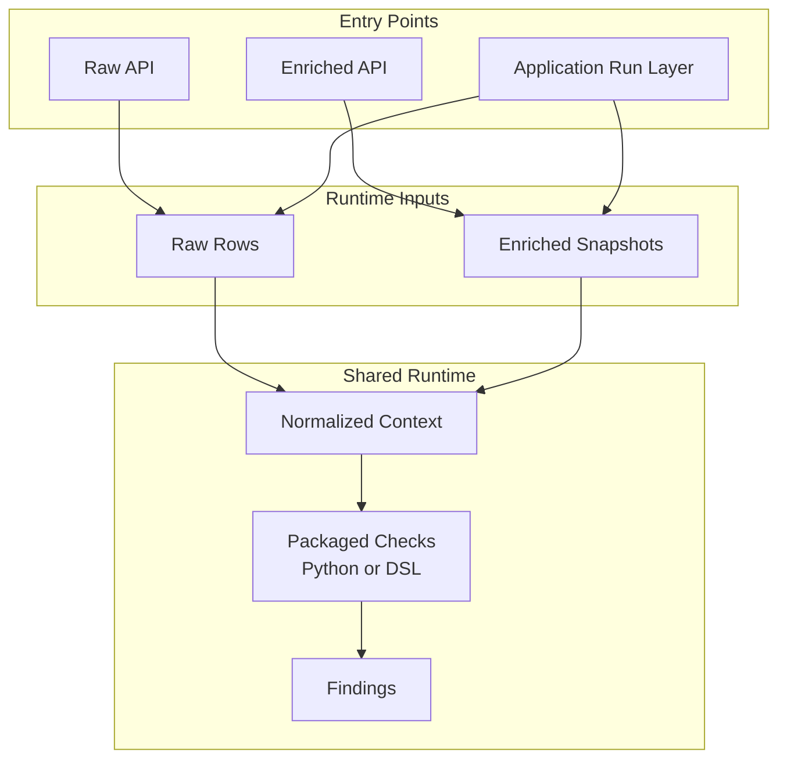

# How the Runtime Model Works

[Back to documentation](../index.md)

The runtime model defines where execution happens and which data shape a migrated check sees.

## Shared Runtime

The shared runtime lives under `src/openfoodfacts_data_quality/`.

It owns:

- packaged check definitions
- the [check catalog](check-model.md#packaged-checks) and check metadata
- input projection and context building
- the public [Python library APIs](../how-to/use-the-python-library.md)

Any repository check belongs here. Keep run orchestration out of this layer.

## Application Run Layer

The application run layer lives under `app/`.

It adds the pieces that exist only for full application runs:

- DuckDB source loading
- [reference data](reference-and-parity.md#reference-data) resolution
- [strict comparison](reference-and-parity.md#strict-comparison)
- run result accumulation
- report and JSON artifact generation

`app/` builds on the shared runtime. The shared runtime does not depend on `app/`.

## Input Surfaces

An input surface is the contract by which product data enters the runtime.

The runtime supports two input surfaces: `raw_products` and `enriched_products`.

### Raw Products

`raw_products` means the check can run from the public [source snapshot](../reference/glossary.md#source-snapshot) alone. The migrated runtime builds its context from raw product rows and does not need enriched data for that check.

### Enriched Products

`enriched_products` means the check depends on stable enriched data that is not present in raw public rows. In application runs, that data is materialized through the [reference path](reference-and-parity.md#reference-path) and projected into the enriched contract owned by Python. In direct library usage, callers can provide [enriched snapshots](../reference/data-contracts.md#enriched-snapshot) explicitly.

The choice between these surfaces changes:

- which checks are eligible for a run
- which data the runtime must prepare
- whether an application run needs the [reference path](reference-and-parity.md#reference-path)

## Normalized Context

Checks do not read raw DuckDB rows or backend payloads directly. They read `NormalizedContext`.

`NormalizedContext` is the shared runtime contract consumed by migrated checks. The runtime converts different input shapes into one structure owned by Python with stable field names and stable dotted paths.

That keeps check logic independent from input shapes tied to one source and lets raw plus enriched runs share one execution model.

### Contract Boundary

Growing `NormalizedContext` affects several parts of the system. The change reaches [check selection](check-model.md), [DSL](check-model.md#dsl-and-python) usage, helper annotations, and tests. Treat it as a stable boundary, not as an incidental helper shape.

## Model Role

The runtime model keeps reusable execution small and explicit.

The application layer can then add source loading, reference handling, and report generation without leaking those concerns into every check definition or every library call.

[Back to documentation](../index.md)
