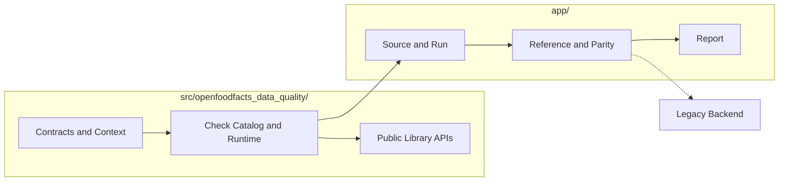

# System Architecture

[Back to documentation](../index.md)

Repository responsibilities are split between `src/` and `app/`.

## Repository Split

`src/openfoodfacts_data_quality/` owns the [shared runtime](runtime-model.md#shared-runtime).

`app/` owns orchestration, source loading, the [reference path](reference-and-parity.md#reference-path), optional [strict comparison](reference-and-parity.md#strict-comparison), and report generation.

`app/` depends on `src/`. `src/` does not depend on `app/`.

## Shared Runtime

`src/openfoodfacts_data_quality/` provides:

- check contracts and [metadata](../reference/check-metadata-and-selection.md)
- [normalized context](runtime-model.md#normalized-context) contracts
- packaged Python and DSL checks
- catalog loading and evaluator selection
- context building and projection
- public [`raw` and `enriched` Python APIs](../how-to/use-the-python-library.md)

## Application Layer

`app/` covers:

- [source snapshot](../reference/glossary.md#source-snapshot) loading from DuckDB
- reference loading through the [reference path](reference-and-parity.md#reference-path), with cache reuse first and backend materialization on cache misses
- [reference result](../reference/data-contracts.md#referenceresult) caching, loading, envelope validation, and projection onto reference findings plus enriched snapshots
- [run result](../reference/data-contracts.md#runresult) accumulation
- [strict comparison](reference-and-parity.md#strict-comparison)
- [report rendering](../reference/report-artifacts.md#html-report), snippet extraction, and local preview

## Repository Map

- `src/openfoodfacts_data_quality/checks/`
  check definitions, the DSL subsystem, registry helpers, catalog loading, and execution
- `src/openfoodfacts_data_quality/context/`
  context building, path metadata, and input projection into [`NormalizedContext`](runtime-model.md#normalized-context)
- `src/openfoodfacts_data_quality/contracts/`
  stable runtime contracts shared across the reusable library APIs
- `app/source/`
  source snapshot access helpers
- `app/run/`
  run preparation, batching, scheduling, run result accumulation, and full application orchestration
- `app/reference/`
  models for the reference side, cache handling, result loading, envelope validation, materializers, and finding normalization
- `app/legacy_backend/`
  the Perl runtime boundary and the persistent session pool that drives it
- `app/legacy_source.py`
  shared Tree-sitter source analysis for report snippets
- `app/parity/`
  [strict comparison](reference-and-parity.md#strict-comparison) logic between reference and migrated findings
- `app/report/`
  static report rendering, JSON download bundling, and snippet presentation

## Boundaries

Put reusable execution behavior in `src/`.

Put source loading, legacy backend integration, strict comparison, and review artifacts in `app/`.

[Back to documentation](../index.md)
