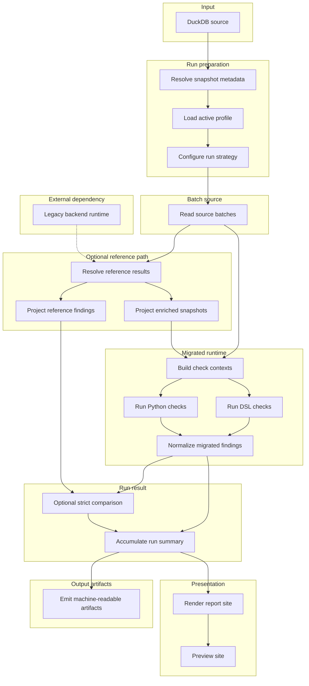

[Back to documentation index](../index.md)

# About application runs

This page explains the full application flow from DuckDB input to report
artifacts.

## Run overview

One run moves through these stages:

1. Resolve snapshot metadata, load the active profile, and choose the run
   strategy.
2. Stream ordered source batches from DuckDB.
3. Resolve
   [reference results](reference-data-and-parity.md#why-the-reference-path-exists)
   when the selected checks need reference findings or enriched snapshots.
4. Build normalized contexts and run the selected Python and DSL checks.
5. Apply strict comparison for checks with a
   [legacy baseline](reference-data-and-parity.md#parity-baselines).
6. Accumulate batch results into
   [`RunResult`](../reference/data-contracts.md#runresult).
7. Write JSON artifacts, render the report, and serve the preview site.

## Run preparation

The run layer resolves:

- the [source snapshot id](../reference/glossary.md#source-snapshot)
- the active [check profile](migrated-checks.md#check-profiles)
- the required [input surface](runtime-model.md#input-surfaces)
- whether the run needs
  [reference results](reference-data-and-parity.md#why-the-reference-path-exists)
- the
  [reference result cache](../reference/run-configuration-and-artifacts.md#reference-result-cache)
  location when selected checks need reference data

The
[source snapshot id](../reference/glossary.md#source-snapshot) comes from
`SOURCE_SNAPSHOT_ID` when set, then from a `<name>.duckdb.snapshot.json`
sidecar, then from a file hash fallback that writes the sidecar for later
runs.

## Source batches

Source rows are streamed from DuckDB in ordered batches. The same reader
contract is used for the bundled sample and for larger snapshots that follow
the same schema.

## Reference path

If the run needs reference findings or enriched snapshots:

- `ReferenceResultLoader` returns one ordered
  [`ReferenceResult`](../reference/data-contracts.md#referenceresult) list for
  the batch.
- Cached reference results are reused when possible.
- Only cache misses are projected into the explicit legacy backend input
  contract.
- Only cache misses are materialized through persistent legacy backend workers.
- `EnrichedSnapshotMaterializer` projects enriched snapshots for the migrated
  runtime.
- `ReferenceFindingMaterializer` projects normalized reference findings for
  strict comparison.

If the run does not need reference data, this branch is skipped.

## Context building and execution

The migrated runtime builds
[normalized contexts](runtime-model.md#normalizedcontext) from:

- [raw rows](../reference/data-contracts.md#rawproductrow) for `raw_products`
- [enriched snapshots](../reference/data-contracts.md#enrichedsnapshotresult)
  for `enriched_products`

The shared engine then loads the selected evaluators and runs them on those
normalized contexts. Python and DSL checks use one execution path.

## Strict comparison

The comparison layer normalizes reference and migrated outputs into
[observed findings](../reference/data-contracts.md#observedfinding) and
compares them with strict multiset equality over:

- product id
- observed code
- severity

Checks with `parity_baseline="none"` skip this step and still contribute
findings plus counts to the run result with
`comparison_status="runtime_only"`.

## Run result and outputs

Results from each batch accumulate into one `RunResult`.

Each active check contributes one
[`RunCheckResult`](../reference/data-contracts.md#runcheckresult). Compared
checks carry match counts and mismatch counts. Checks that run without
comparison carry migrated findings without a comparison against the reference
side.

The completed run produces:

- a static HTML report
- [`run.json`](../reference/report-artifacts.md#runjson)
- [`snippets.json`](../reference/report-artifacts.md#snippetsjson)
- a bundled JSON export archive
- `legacy-backend-stderr.log` when the backend worker starts and emits stderr

`run.json` and `snippets.json` include root `kind` and `schema_version`
metadata.

`snippets.json` also records
[`legacy_snippet_status`](../reference/report-artifacts.md#snippetsjson) on
each check, so checks that run without comparison and unavailable legacy
provenance stay distinguishable without parsing HTML.

## Related information

- [About the system architecture](system-architecture.md)
- [About reference data and parity](reference-data-and-parity.md)
- [Report artifacts](../reference/report-artifacts.md)

[Back to documentation index](../index.md)
