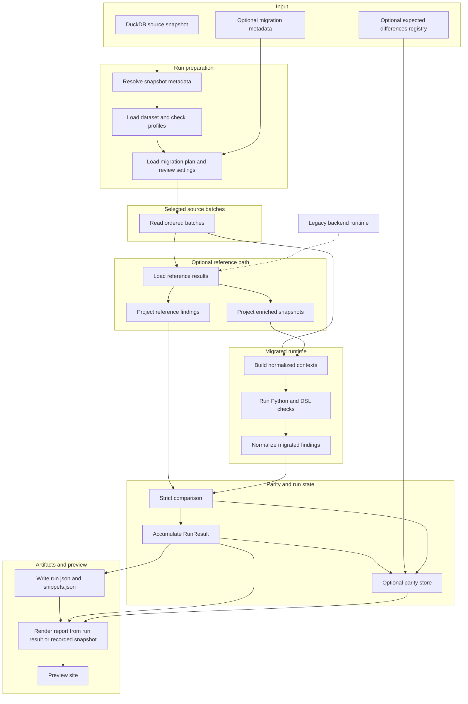
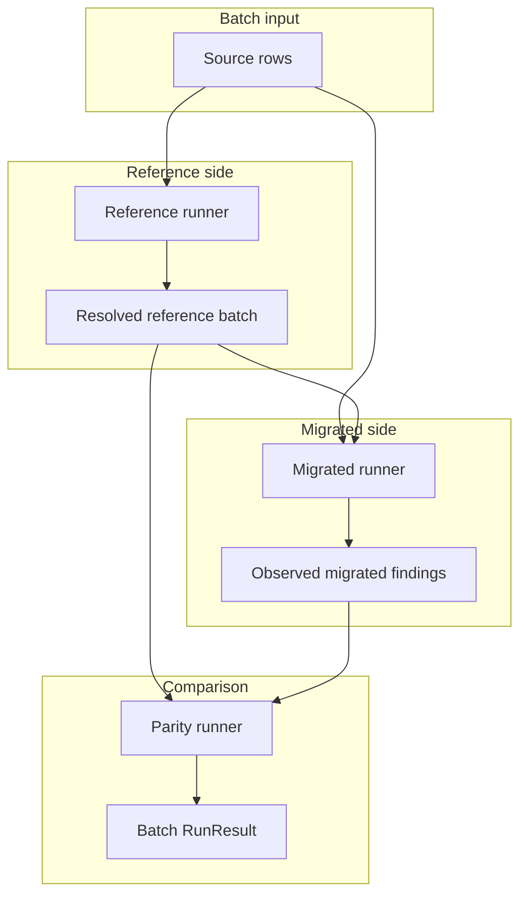
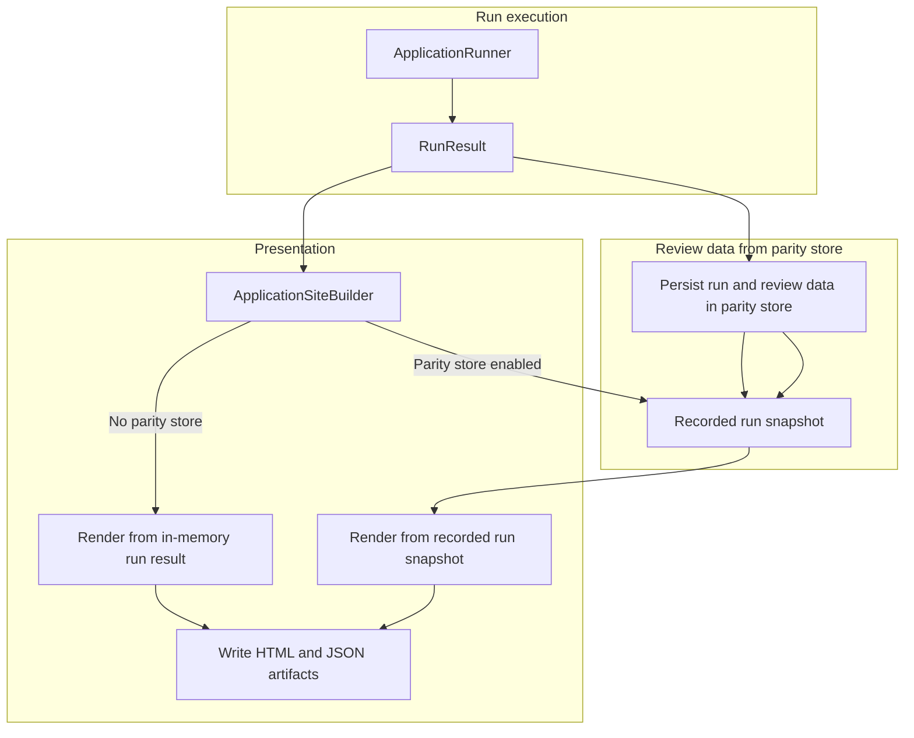

[Back to documentation index](../index.md)

# About application runs

An application run starts from DuckDB input and ends with report artifacts plus
stored review data.

## Run overview

One run moves through these stages:

1. Resolve snapshot metadata. Load the active dataset and check profiles. Load
   optional migration metadata and review settings.
2. Stream ordered source batches from DuckDB using the active dataset profile.
3. Resolve
   [reference results](reference-data-and-parity.md#why-the-reference-path-exists)
   when the selected checks need reference findings or enriched snapshots.
4. Build normalized contexts and run the selected Python and DSL checks.
5. Apply strict comparison for checks with a
   [legacy baseline](reference-data-and-parity.md#parity-baselines).
6. Accumulate batch results into
   [`RunResult`](../reference/data-contracts.md#runresult). When the parity
   store is enabled, record review data there too.
7. Write JSON artifacts, render the report, and serve the preview site.

## Run preparation

The run layer resolves:

- the [source snapshot id](../reference/glossary.md#source-snapshot)
- the active
  [dataset profile](../reference/run-configuration-and-artifacts.md#dataset-profiles)
- the active [check profile](migrated-checks.md#check-profiles)
- the required [input surface](runtime-model.md#input-surfaces)
- whether the run needs
  [reference results](reference-data-and-parity.md#why-the-reference-path-exists)
- the
  [reference result cache](../reference/run-configuration-and-artifacts.md#reference-result-cache)
  namespace when selected checks need reference data
- the optional migration catalog and the active migration family coverage for
  the selected checks
- the optional registry of expected differences and
  [parity store](../reference/run-configuration-and-artifacts.md#parity-store)
  settings

The
[source snapshot id](../reference/glossary.md#source-snapshot) comes from
`SOURCE_SNAPSHOT_ID` when set, then from a `<name>.duckdb.snapshot.json`
sidecar, then from a file hash fallback that writes the sidecar for later
runs.

Optional migration metadata comes from `MIGRATION_INVENTORY_PATH` and
`MIGRATION_ESTIMATION_SHEET_PATH`. Review settings here means the parity store
path and the optional expected differences registry from
`PARITY_EXPECTED_DIFFERENCES_PATH`.

## Source batches

Source rows are streamed from DuckDB in ordered batches. The batch reader
always validates the explicit
[`RawProductRow`](../reference/data-contracts.md#rawproductrow) source
contract.

The active dataset profile decides which rows the run sees:

- `all_products` uses the whole `products` table.
- `stable_sample` uses a deterministic hash of product code plus seed and then
  applies `sample_size`.
- `code_list` restricts the run to an explicit list of product codes.

The dataset profile changes run coverage. It does not change the
[runtime surface](runtime-model.md#input-surfaces) or the
[`NormalizedContext`](runtime-model.md#normalizedcontext) shape.

## Reference path

If the run needs reference findings or enriched snapshots:

- `ReferenceResultLoader` returns one ordered
  [`ReferenceResult`](../reference/data-contracts.md#referenceresult) list for
  the batch.
- Cached reference results are reused when possible.
- Only cache misses are projected into the explicit legacy backend input
  contract.
- Only cache misses are materialized through persistent legacy backend workers.
- `EnrichedSnapshotMaterializer` projects enriched snapshots for the migrated
  runtime.
- `ReferenceFindingMaterializer` projects normalized reference findings for
  strict comparison.

If the run does not need reference data, this branch is skipped.

## Context building and execution

The migrated runtime builds
[normalized contexts](runtime-model.md#normalizedcontext) from:

- [raw rows](../reference/data-contracts.md#rawproductrow) for `raw_products`
- [enriched snapshots](../reference/data-contracts.md#enrichedsnapshotresult)
  for `enriched_products`

The shared engine then loads the selected evaluators and runs them on those
normalized contexts. Python and DSL checks use one execution path.

The batch loop keeps reference loading separate from migrated checks. A parity
runner compares the two outputs. Batches can execute concurrently, but merged
results stay ordered by batch index.

Inside the batch loop, `BatchExecutionContext` keeps three application-owned
services separate:

The reference runner resolves reference-side data for the batch. The migrated
runner observes migrated findings on the selected runtime surface. The parity
runner turns the two finding streams into the batch result that the accumulator
merges into the final run output.

## Strict comparison and governance

The comparison layer normalizes reference and migrated outputs into
[observed findings](../reference/data-contracts.md#observedfinding) and
compares them with strict multiset equality over:

- product id
- observed code
- severity

Checks with `parity_baseline="none"` skip this step and still contribute
findings plus counts to the run result with
`comparison_status="runtime_only"`.

When the run uses a
[parity store](../reference/run-configuration-and-artifacts.md#parity-store),
the store also records each concrete missing or extra finding. If an
[expected differences registry](reference-data-and-parity.md#expected-differences-policy)
is active, the recorder classifies those persisted mismatches as expected or
unexpected for review. That governance layer does not change strict comparison
semantics or turn failed checks into passing checks.

## Run result and outputs

`ApplicationRunner` resets `artifacts/latest/`, executes the prepared run, and
builds the final
[`RunResult`](../reference/data-contracts.md#runresult).

`ApplicationSiteBuilder` then renders the review site. With a parity store, it
loads the recorded run snapshot. Without one, it uses the in-memory
`RunResult`.

Governance counts for expected differences appear only on the path that reads
from the parity store.

The completed run produces:

- a static HTML report
- [`run.json`](../reference/report-artifacts.md#runjson)
- [`snippets.json`](../reference/report-artifacts.md#snippetsjson)
- a bundled JSON export archive
- `legacy-backend-stderr.log` when the backend worker starts and emits stderr

The parity store, when enabled, also persists:

- run configuration and status
- batch telemetry
- concrete mismatches with optional expected-difference rule ids
- governance summaries for each check
- dataset profile metadata
- active migration family metadata
- a serialized copy of `run.json`

`run.json` and `snippets.json` include root `kind` and `schema_version`
metadata.

`snippets.json` also records
[`legacy_snippet_status`](../reference/report-artifacts.md#snippetsjson) on
each check, so checks that run without comparison and unavailable legacy
provenance stay distinguishable without parsing HTML.

## Related information

- [About the system architecture](system-architecture.md)
- [About reference data and parity](reference-data-and-parity.md)
- [Report artifacts](../reference/report-artifacts.md)

[Back to documentation index](../index.md)
