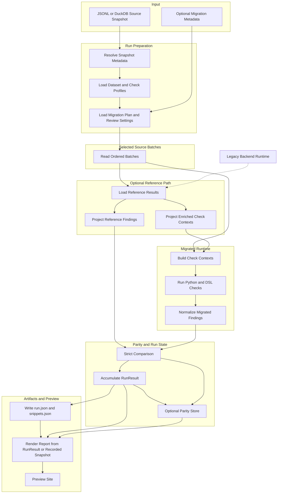
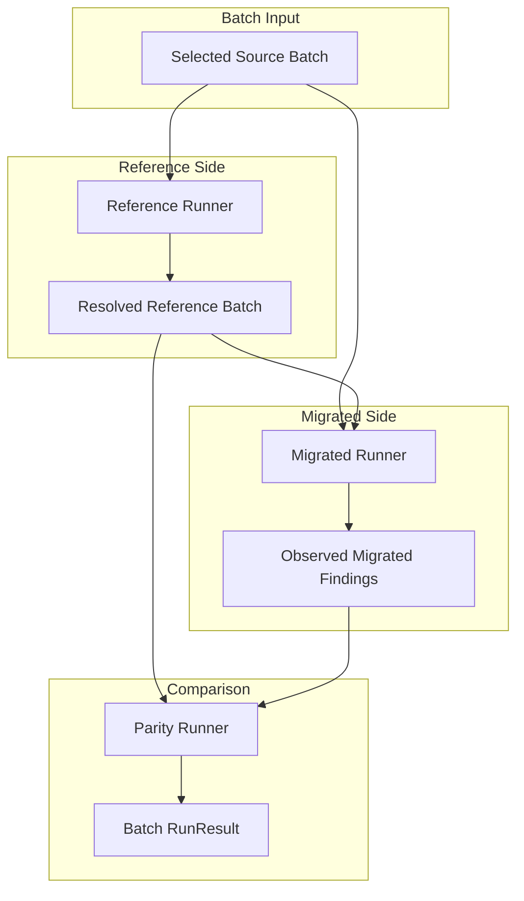
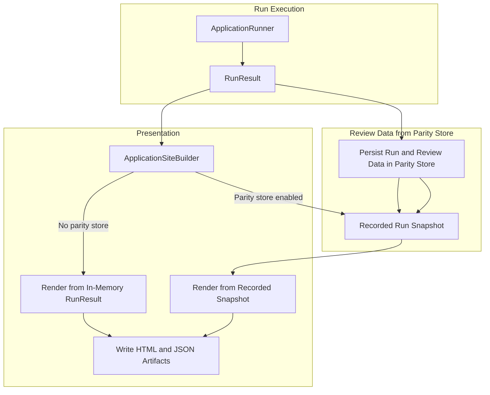

[Back to documentation index](../index.md)

# About application runs

An application run starts from a full product source snapshot and ends with
report artifacts plus stored review data.

## Run overview

One run moves through these stages:

1. Resolve snapshot metadata. Load the active dataset and check profiles. Load
   optional migration metadata and review settings.
2. Stream ordered source batches from the configured source snapshot using the
   active dataset profile.
3. Resolve
   [reference results](reference-data-and-parity.md#why-the-reference-path-exists)
   when the selected checks need reference findings or enriched snapshot check
   input.
4. Build check contexts and run the selected Python and DSL checks.
5. Apply strict comparison for checks with a
   [legacy baseline](reference-data-and-parity.md#parity-baselines).
6. Accumulate batch results into
   [`RunResult`](../reference/data-contracts.md#runresult). When the parity
   store is enabled, record review data there too.
7. Write JSON artifacts, render the report, and serve the preview site.

## Run preparation

The run layer resolves:

- the [source snapshot id](../reference/glossary.md#source-snapshot)
- the active
  [dataset profile](../reference/run-configuration-and-artifacts.md#dataset-profiles)
- the active [check profile](migrated-checks.md#check-profiles)
- the required [context provider](runtime-model.md#context-providers)
- whether the run needs
  [reference results](reference-data-and-parity.md#why-the-reference-path-exists)
- the
  [reference result cache](../reference/run-configuration-and-artifacts.md#reference-result-cache)
  namespace when selected checks need reference results
- the optional migration catalog and the active migration family coverage for
  the selected checks
- [parity store](../reference/run-configuration-and-artifacts.md#parity-store)
  settings

The [source snapshot id](../reference/glossary.md#source-snapshot) comes from
`SOURCE_SNAPSHOT_ID` when set, then from a `<name>.<suffix>.snapshot.json`
sidecar, then from a file hash fallback that writes the sidecar for later runs.

Optional migration metadata comes from `MIGRATION_INVENTORY_PATH` and
`MIGRATION_ESTIMATION_SHEET_PATH`. Review settings here means the parity store
path.

## Source batches

Source batches come from app-owned JSONL and DuckDB adapters. Each batch record keeps
the full [`ProductDocument`](../reference/data-contracts.md#productdocument) for
the reference path and a projected
[`SourceProduct`](../reference/data-contracts.md#sourceproduct) for the migrated
runtime.

DuckDB source snapshots must expose a `products` table with a `code` column.
JSONL source snapshots must contain one product document object per nonblank
line. Unsupported formats fail before batch execution starts.

The active dataset profile decides which rows the run sees:

- `all_products` uses the whole `products` table.
- `stable_sample` uses a deterministic hash of product code plus seed and then
  applies `sample_size`.
- `code_list` restricts the run to an explicit list of product codes.

The dataset profile changes run coverage. It does not change the
[runtime provider](runtime-model.md#context-providers) or the
[`CheckContext`](runtime-model.md#checkcontext) contract.

## Reference path

If the run needs reference findings or enriched snapshot check input:

- `ReferenceResultLoader` returns one ordered
  [`ReferenceResult`](../reference/data-contracts.md#referenceresult) list for
  the batch.
- Cached reference results are reused when possible.
- Only cache misses are serialized as full product documents for the legacy
  backend.
- Only cache misses are materialized through persistent legacy backend workers.
- `ReferenceCheckContextMaterializer` projects enriched `CheckContext` values
  for the migrated runtime.
- `ReferenceFindingMaterializer` projects normalized reference findings for
  strict comparison.

If the run does not need reference results, this branch is skipped.

## Context building and execution

The migrated runtime builds
[check contexts](runtime-model.md#checkcontext) from:

- [source products](../reference/data-contracts.md#sourceproduct) for `source_products`
- `CheckContext` values projected from
  [`ReferenceResult`](../reference/data-contracts.md#referenceresult) for
  `enriched_snapshots` in application runs
- [enriched snapshots](../reference/data-contracts.md#enrichedsnapshotrecord)
  for `enriched_snapshots` in direct library usage

The shared engine then loads the selected evaluators and runs them on those
check contexts. Python and DSL checks use one execution path.

The batch loop separates reference loading from migrated checks. A parity
runner compares the two outputs. Batches can execute concurrently, but merged
results stay ordered by batch index.

Inside the batch loop, `BatchExecutionContext` uses three separate
application-owned services:

The reference runner resolves reference results for the batch. The migrated
runner observes migrated findings on the selected runtime provider. The parity
runner turns the two finding streams into the batch result that the accumulator
merges into the final run output.

## Strict comparison and persistence

The comparison layer normalizes reference and migrated outputs into
[observed findings](../reference/data-contracts.md#observedfinding) and
compares them with strict multiset equality over:

- product id
- observed code
- severity

Checks with `parity_baseline="none"` skip this step and still contribute
findings plus counts to the run result with
`comparison_status="runtime_only"`.

When the run uses a
[parity store](../reference/run-configuration-and-artifacts.md#parity-store),
the store also records each concrete missing or extra finding. That stored
review data does not change strict comparison semantics or turn failed checks
into passing checks.

## Run result and outputs

`ApplicationRunner` resets `artifacts/latest/`, executes the prepared run, and
builds the final
[`RunResult`](../reference/data-contracts.md#runresult).

`ApplicationSiteBuilder` then renders the review site. With a parity store, it
loads the recorded run snapshot. Without one, it uses the in-memory
`RunResult`.

The completed run produces:

- a static HTML report
- [`run.json`](../reference/report-artifacts.md#runjson)
- [`snippets.json`](../reference/report-artifacts.md#snippetsjson)
- a bundled JSON export archive
- `legacy-backend-stderr.log` when the backend worker starts and emits stderr

The parity store, when enabled, also persists:

- run configuration and status
- batch telemetry
- concrete mismatches
- dataset profile metadata
- active migration family metadata
- a serialized copy of `run.json`

`run.json` and `snippets.json` include root `kind` and `schema_version`
metadata.

`snippets.json` also records
[`legacy_snippet_status`](../reference/report-artifacts.md#snippetsjson) on
each check, so checks that run without comparison and unavailable legacy
provenance stay distinguishable without parsing HTML.

## Related information

- [About the system architecture](system-architecture.md)
- [About reference and parity](reference-data-and-parity.md)
- [Report artifacts](../reference/report-artifacts.md)

[Back to documentation index](../index.md)
