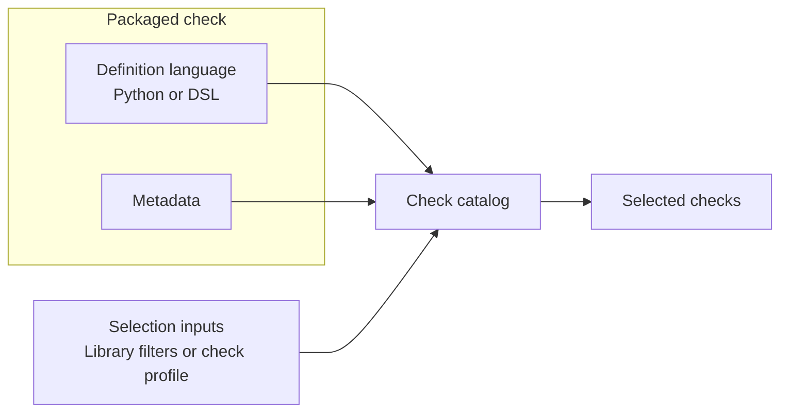

[Back to documentation index](../index.md)

# About migrated checks

A migrated check combines evaluator logic with metadata. The sections below
show how that definition is used in packaged checks and check profiles.

## Packaged checks

Checks are packaged repository content under
`src/openfoodfacts_data_quality/checks/`.

A packaged check includes evaluator logic plus the metadata that tells the
runtime where the rule can run and how it should be selected.

The catalog loads packaged checks for library calls and application runs. A
check hidden inside `app/` would not use the
[shared runtime](runtime-model.md#why-the-runtime-is-split) and would exist
only for one orchestration path.

## Definition languages

Each check uses one definition language: Python or the repository DSL.

### DSL checks

The repository DSL is a small declarative language written in YAML for rules
that work as direct predicates on approved
[CheckContext](runtime-model.md#checkcontext) fields.

A DSL check describes a condition and the finding that condition should emit.

### Python checks

Python checks are ordinary repository code. They receive the same runtime
context and emit findings through the same contracts.

Use the DSL when the rule is a direct boolean statement over approved
`CheckContext` paths and one static severity is enough.

Use Python when the rule needs:

- loops or aggregation
- logic that depends on helpers
- richer numeric reasoning
- dynamic emitted codes

Once loaded, Python and DSL checks share the same metadata model,
[selection model](../reference/check-metadata-and-selection.md#selection-inputs),
and execution path.

## Metadata

Metadata is the structured information attached to a check definition.

The evaluator says what finding to emit. The metadata says where the check can
run, how the runtime selects it, and whether it participates in
[parity](reference-data-and-parity.md#parity-baselines).

These fields define most of that behavior:

- `required_context_paths`
- `parity_baseline`
- `jurisdictions`
- `legacy_identity`

Selection, validation, parity, and reporting all depend on this metadata.
For Python checks, authors declare context paths with `requires=(...)`; the
catalog exposes them as `required_context_paths`.

For the exact field list and selection inputs, see
[Check metadata and selection](../reference/check-metadata-and-selection.md).

## Check profiles

A check profile is a named application preset from `config/check-profiles.toml`.

Profiles do not define checks. They select a run from the checks that already
exist in the packaged catalog.

Profiles can narrow the active checks by:

- the context paths available through the selected
  [context provider](runtime-model.md#context-providers)
- [parity baseline](reference-data-and-parity.md#parity-baselines)
- jurisdiction
- explicit check ids in profiles with `mode = "include"`
- optional migration metadata filters such as target implementation, size, or
  risk when the application has a migration catalog

Those migration filters live on the profile, not on the check definition. They
let one application run focus on a planning subset without changing the
underlying packaged checks.

For example, one profile can select only checks whose matched migration family
is planned for `dsl` or marked as low risk. This creates a planning subset
without forking the check catalog itself.

## Why this split matters

The check model keeps rule logic, rule metadata, and run selection explicit.

That separation supports reusable library execution,
[application runs](application-runs.md), [parity comparison](reference-data-and-parity.md#strict-comparison),
checks that run without comparison, migration planning subsets, and short
local validation loops without redefining checks for each environment.

## Related information

- [About the runtime model](runtime-model.md)
- [About reference and parity](reference-data-and-parity.md)
- [Check metadata and selection](../reference/check-metadata-and-selection.md)

[Back to documentation index](../index.md)
