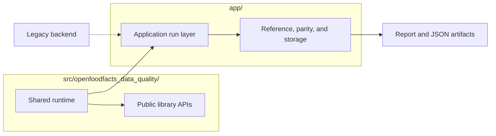

[Back to documentation index](../index.md)

# About the project scope

This repository migrates legacy data quality checks into a reusable Python
system with parity validation against the legacy backend.

The goal is behavioral fidelity first, then a runtime that is easier to test,
run locally, and evolve.

## Why the repository is split

The repository keeps reusable runtime logic in
`src/openfoodfacts_data_quality/` and application orchestration in `app/`.

Python callers can use the shared runtime without the application layer.
Compared runs and enriched application runs still depend on the legacy backend
through the
[reference path](reference-data-and-parity.md#why-the-reference-path-exists).
Live backend execution happens only on cache misses.

## What the repository already supports

- A shared Python runtime with explicit raw and enriched input surfaces.
- Runtime contracts owned by Python for raw rows, enriched snapshots, and
  normalized context.
- Packaged checks written in Python and `dsl`.
- Application runs that mix compared checks with checks that run without
  comparison.
- Runs over whole snapshots or deterministic subsets.
- Governance for expected differences on recorded parity mismatches.
- Static HTML output plus JSON artifacts for review.

## What is stable enough to build on

- the shared [runtime contracts](../reference/data-contracts.md)
- the [`NormalizedContext`](runtime-model.md#normalizedcontext) model
- the packaged [check catalog](../reference/check-metadata-and-selection.md)
- [application runs](application-runs.md) as a regular workflow
- [run and snippet artifacts](../reference/report-artifacts.md)
- review data from one completed run in the parity store

## What is still evolving

- how broad the DSL should become
- where whole snapshot runs should live outside short local loops
- how the report should evolve beyond migration review
- when the raw and enriched APIs should become durable public interfaces

## Limits

- The repository is not yet a full replacement for every legacy data-quality
  rule.
- Compared runs and enriched application runs still depend on the
  [ReferenceResult](../reference/data-contracts.md#referenceresult) contract
  and the
  [reference path](reference-data-and-parity.md#why-the-reference-path-exists)
  behind it.
- The report is optimized for review, not exhaustive debugging detail.
- Governance metadata for expected differences lives in the parity store and
  report layer, not in the canonical `run.json` artifact.
- The public Python APIs are explicit project contracts, but they are not yet
  durable compatibility promises.

## Related information

- [About the system architecture](system-architecture.md)
- [About application runs](application-runs.md)
- [Roadmap and open questions](../project/roadmap-and-open-questions.md)

[Back to documentation index](../index.md)
