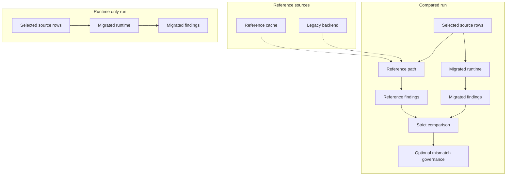

[Back to documentation index](../index.md)

# About reference data and parity

Some runs need reference data before they can compare migrated behavior with
legacy behavior. The sections below cover that path and the review rules around
it.

## What `reference` means

Use `reference` for parity runtime data. Use `legacy backend` for the Perl
execution boundary.

The legacy backend may produce the data, but the runtime owns the contract it
consumes. Python validates the backend envelope and then works with
[`ReferenceResult`](../reference/data-contracts.md#referenceresult).

## Why the reference path exists

The reference path is the flow in the application that resolves the data needed
for one run or one batch.

It exists because:

- compared checks need reference findings for strict comparison
- enriched application runs need
  [enriched snapshots](../reference/data-contracts.md#enrichedsnapshotresult)

### Cache reuse and live materialization

The reference path checks the
[reference result cache](../reference/run-configuration-and-artifacts.md#reference-result-cache)
first. On a cache hit, the run reuses an existing `ReferenceResult`. On a cache
miss, the application projects the needed input into the legacy backend
boundary, materializes a backend result, validates it, and stores the
resulting reference payload in the cache namespace for that run contract.

### Compared raw runs still use the reference path

Compared raw runs still need the reference path. `raw_products` on the
migrated side only means that the migrated context comes from raw rows. The
comparison still needs reference findings.



## Strict comparison

Strict comparison checks whether reference and migrated findings match exactly
for one compared check.

The comparison uses normalized
[ObservedFinding](../reference/data-contracts.md#observedfinding) values, not
raw evaluator output and not the check id alone. It applies multiset equality
over:

- product id
- observed code
- severity

Duplicates, dynamic emitted codes, and severity mismatches can still fail
parity when the underlying rule looks close to the legacy version.

## Expected differences policy

The expected differences registry marks known mismatches so review can focus on
the rest.

It is useful for runs with parity gaps you already understand and still want to
track separately from fresh differences.

A concrete mismatch is one recorded missing or extra finding for one check,
product, observed code, and severity.

Each rule matches one set of concrete mismatches by:

- mismatch kind, `missing` or `extra`
- one or more check ids
- optionally one or more observed codes
- optionally one or more severities
- optionally one or more product ids

Example:

```toml
schema_version = 1

[[rules]]
id = "quantity-known-gap"
justification = "Known migration gap under review."
check_id = "en:quantity-not-recognized"
mismatch_kind = "missing"
severity = "warning"
```

This rule says that missing `warning` findings from
`en:quantity-not-recognized` are already known during review.

When the run records data in the
[parity store](../reference/run-configuration-and-artifacts.md#parity-store),
the recorder classifies each persisted mismatch against those rules.

That classification:

- marks mismatches as expected or unexpected for report review
- is rejected when multiple rules overlap on the same concrete mismatch
- does not change strict comparison behavior
- does not rewrite `RunResult` or `run.json`

The HTML report can show governed mismatch totals only when it is rendered from
a snapshot loaded from the parity store.

For the exact TOML contract, see
[Expected differences registry](../reference/run-configuration-and-artifacts.md#expected-differences-registry).

## Parity baselines

`parity_baseline` is the [metadata](migrated-checks.md#metadata) axis that
decides whether a check enters strict comparison.

- `legacy`: The check is compared against legacy behavior.
- `none`: The check runs without comparison and is treated as runtime only.

This is metadata on each check, so one run can include compared checks and
checks that run without comparison in the same profile.

## Why the model matters

The parity model keeps comparison explicit.

Reference data is loaded only when selected checks need it. Checks that run
without comparison skip that path. Compared runs still preserve fidelity to
trusted backend behavior because they compare against validated reference
findings instead of assuming the migrated implementation is already correct.

The governance layer stays separate from parity itself, so review exceptions do
not blur the underlying comparison contract.

## Related information

- [About migrated checks](migrated-checks.md)
- [About application runs](application-runs.md)
- [Data contracts](../reference/data-contracts.md)

[Back to documentation index](../index.md)
