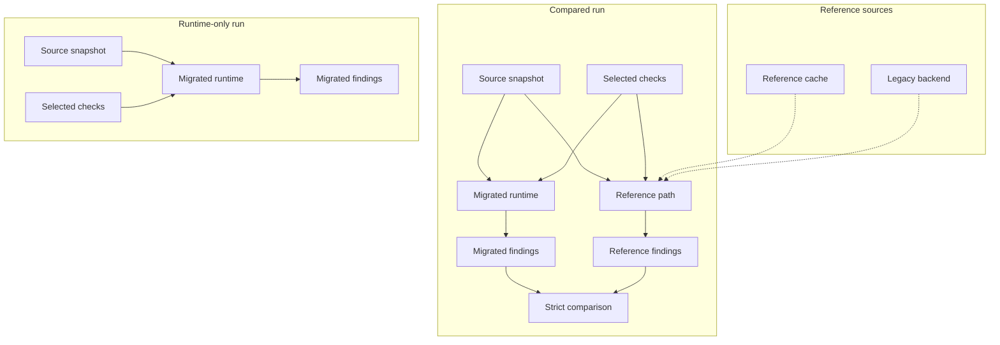

[Back to documentation index](../index.md)

# About reference data and parity

This page explains why some runs need reference data and how strict comparison
works.

## What `reference` means

Use `reference` for parity runtime data. Use `legacy backend` for the Perl
execution boundary.

The legacy backend may produce the data, but the runtime owns the contract it
consumes. Python validates the backend envelope and then works with
[`ReferenceResult`](../reference/data-contracts.md#referenceresult).

## Why the reference path exists

The reference path is the flow in the application that resolves the data needed
for one run or one batch.

It exists because:

- compared checks need reference findings for strict comparison
- enriched application runs need
  [enriched snapshots](../reference/data-contracts.md#enrichedsnapshotresult)

### Cache reuse and live materialization

The reference path checks the
[reference result cache](../reference/run-configuration-and-artifacts.md#reference-result-cache)
first. On a cache hit, the run reuses an existing `ReferenceResult`. On a
cache miss, the application projects the needed input into the legacy backend
boundary, materializes a backend result, validates it, and stores the
resulting reference payload in the cache namespace for that run contract.

### Compared raw runs still use the reference path

Compared raw runs still need the reference path. The migrated side may build
its context from raw rows, but the comparison still needs reference findings.

**Note:** `raw_products` on the migrated side does not mean that a compared run
can skip the reference path.

## Strict comparison

Strict comparison checks whether reference and migrated findings match exactly
for one compared check.

The comparison uses normalized
[ObservedFinding](../reference/data-contracts.md#observedfinding) values, not
raw evaluator output and not the check id alone. It applies multiset equality
over:

- product id
- observed code
- severity

Duplicates, dynamic emitted codes, and severity mismatches can still fail
parity when the underlying rule looks close to the legacy version.

## Parity baselines

`parity_baseline` is the [metadata](migrated-checks.md#metadata) axis that
decides whether a check enters strict comparison.

- `legacy`: The check is compared against legacy behavior.
- `none`: The check runs without comparison and is treated as runtime only.

This is metadata on each check, so one run can include compared checks and
checks that run without comparison in the same profile.

## Why the model matters

The parity model keeps comparison explicit.

Reference data is loaded only when selected checks need it. Checks that run
without comparison skip that path. Compared runs still preserve fidelity to
trusted backend behavior because they compare against validated reference
findings instead of assuming the migrated implementation is already correct.

## Related information

- [About migrated checks](migrated-checks.md)
- [About application runs](application-runs.md)
- [Data contracts](../reference/data-contracts.md)

[Back to documentation index](../index.md)
