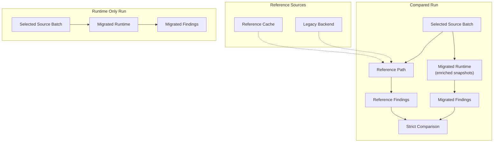

[Back to documentation index](../index.md)

# About reference and parity

Some runs need reference results before they can compare migrated behavior with
legacy behavior. The sections below cover that path and the review rules around
it.

## What `reference` means

Use `reference` for parity runtime data. Use `legacy backend` for the Perl
execution boundary.

The legacy backend may produce the data, but the runtime owns the contract it
consumes. Python validates the backend envelope and then works with
[`ReferenceResult`](../reference/data-contracts.md#referenceresult).

## Why the reference path exists

The reference path is the flow in migration tooling that resolves the data needed
for one run or one batch.

It exists because:

- compared checks need reference findings for strict comparison
- enriched snapshot migration runs need
  [`CheckContext`](../reference/data-contracts.md#checkcontext) values projected
  from [ReferenceResult](../reference/data-contracts.md#referenceresult)

### Cache reuse and backend materialization

The reference path checks the
[reference result cache](../reference/run-configuration-and-artifacts.md#reference-result-cache)
first. On a cache hit, the run reuses an existing `ReferenceResult`. On a cache
miss, migration tooling projects the needed input into the legacy backend
boundary, gets a backend result, validates it, and stores the resulting
reference payload in the cache namespace for that run contract.

### Strict parity runs always use the reference path

Strict parity runs always need the reference path. The migrated side now runs
on `enriched_snapshots` during migration parity, and the comparison still
needs reference findings from the validated backend payload.

## Strict comparison

Strict comparison checks whether reference and migrated findings match exactly
for one compared check.

The comparison uses normalized
[ObservedFinding](../reference/data-contracts.md#observedfinding) values, not
raw evaluator output and not the check id alone. It applies multiset equality
over:

- product id
- observed code
- severity

Duplicates, dynamic emitted codes, and severity mismatches can still fail
parity even when the underlying rule appears close to the legacy version.

## Parity baselines

`parity_baseline` is the [metadata](migrated-checks.md#metadata) axis that
decides whether a check enters strict comparison.

- `legacy`: The check is compared against legacy behavior.
- `none`: The check runs without comparison and is treated as runtime only.

This is metadata on each check, so one run can include compared checks and
checks that run without comparison in the same profile.

## Why the model matters

The parity model keeps comparison explicit.

Reference data is loaded only when selected checks need it. Checks that run
without comparison skip that path. Strict parity preserves fidelity to trusted
backend behavior because it compares migrated findings on enriched snapshots
against validated reference findings instead of assuming the migrated
implementation is already correct.

## Related information

- [About migrated checks](migrated-checks.md)
- [About migration runs](migration-runs.md)
- [Data contracts](../reference/data-contracts.md)

[Back to documentation index](../index.md)
