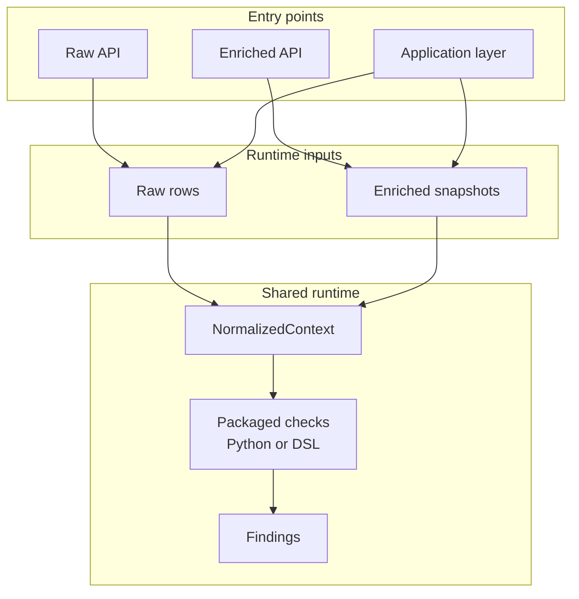

[Back to documentation index](../index.md)

# About the runtime model

The runtime model explains where check execution happens and which contract a
migrated check receives.

## Why the runtime is split

The shared runtime lives under `src/openfoodfacts_data_quality/`. It owns:

- packaged check definitions
- the [check catalog](migrated-checks.md#packaged-checks) and check metadata
- input projection and context building
- the public [Python library APIs](../how-to/use-the-python-library.md)

The application layer lives under `app/`. It adds the parts that exist only
for full application runs:

- DuckDB source loading
- [reference data](reference-data-and-parity.md#why-the-reference-path-exists)
  resolution
- [strict comparison](reference-data-and-parity.md#strict-comparison)
- [`RunResult`](../reference/data-contracts.md#runresult) accumulation
- [report and JSON artifact generation](../reference/report-artifacts.md)

`app/` builds on the shared runtime. The shared runtime does not depend on
`app/`.

## Input surfaces

An input surface is the contract by which product data enters the runtime.

The runtime supports two input surfaces: `raw_products` and
`enriched_products`.

### Raw product runs

`raw_products` means the check can run from the public
[source snapshot](../reference/glossary.md#source-snapshot) alone. The
migrated runtime builds its context from
[raw product rows](../reference/data-contracts.md#rawproductrow) and does not
need enriched data for that check.

### Enriched product runs

`enriched_products` means the check depends on stable enriched data that is
not present in raw public rows. In application runs, that data is materialized
through the [reference path](reference-data-and-parity.md#why-the-reference-path-exists)
and projected into the enriched contract owned by Python. In direct library
usage, callers can provide
[enriched snapshots](../reference/data-contracts.md#enrichedsnapshotresult)
explicitly.

The selected surface changes:

- which checks are eligible for a run
- which data the runtime must prepare
- whether an application run needs the
  [reference path](reference-data-and-parity.md#why-the-reference-path-exists)

## NormalizedContext

Checks do not read raw DuckDB rows or backend payloads directly. They read
`NormalizedContext`.

`NormalizedContext` is the shared runtime contract consumed by migrated checks.
The runtime converts different input shapes into one structure owned by Python
with stable field names and stable dotted paths.

That keeps check logic independent from source-specific shapes and lets raw and
enriched runs share one execution model.

## Why this boundary matters

Growing `NormalizedContext` affects several parts of the system. The change
reaches
[check selection](../reference/check-metadata-and-selection.md#selection-inputs),
[DSL](migrated-checks.md#definition-languages) usage,
[helper annotations](../reference/check-metadata-and-selection.md#dependency-invariant),
and tests.

Treat `NormalizedContext` as a stable boundary, not as an incidental helper
shape.

## Related information

- [About migrated checks](migrated-checks.md)
- [About reference data and parity](reference-data-and-parity.md)
- [Data contracts](../reference/data-contracts.md)

[Back to documentation index](../index.md)
