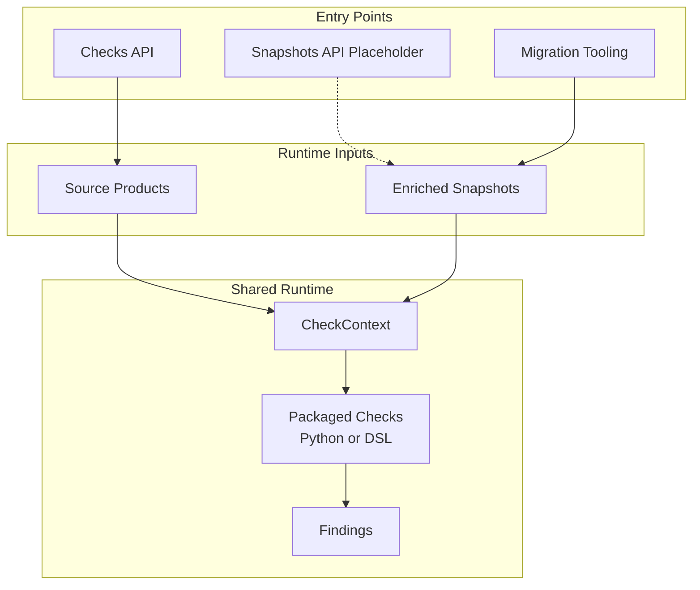

[Back to documentation index](../index.md)

# About the runtime model

The runtime model explains where check execution happens and which contract a
migrated check receives.

## Why the runtime is split

The shared runtime lives under `src/off_data_quality/`. It owns:

- packaged check definitions
- the [check catalog](migrated-checks.md#packaged-checks) and check metadata
- input projection and context building
- the public [Python library APIs](../how-to/use-the-python-library.md)

The migration tooling lives under `migration/`. It adds the parts that exist
only for full migration runs:

- migration source snapshot loading
- dataset profile selection for one run
- [reference](reference-data-and-parity.md#why-the-reference-path-exists)
  resolution
- [strict comparison](reference-data-and-parity.md#strict-comparison)
- [`RunResult`](../reference/data-contracts.md#runresult) accumulation
- parity store persistence and
  [report artifact generation](../reference/report-artifacts.md)

`migration/` builds on the shared runtime. The shared runtime does not depend
on `migration/`.

## Context providers

A context provider is the contract by which product data enters the runtime.
Each provider owns its context builder and the context paths it can expose.
Check selection uses that provider contract instead of a separate surface list.

The runtime supports two context providers: `source_products` and
`enriched_snapshots`.

### Source product runs

`source_products` means the runtime builds check contexts from source products
without an enriched snapshot. The migrated runtime exposes the context paths
that can be built from those records.

### Enriched snapshot runs

`enriched_snapshots` means the check depends on stable enriched data that is not
present in source products. In migration runs, that data is materialized
through the [reference path](reference-data-and-parity.md#why-the-reference-path-exists)
and projected directly into `CheckContext` before the migrated
checks run.

The selected provider changes:

- which required context paths are available to checks
- which data the runtime must prepare
- whether a migration run needs the
  [reference path](reference-data-and-parity.md#why-the-reference-path-exists)

The current public library entry point for loaded rows is `checks`. The
repository also keeps `snapshots` as a future library API placeholder. The
internal provider ids remain `source_products` and `enriched_snapshots`.

## Context provider and dataset profile are different

Migration tooling uses two independent selection axes:

- the check context provider, which decides which context paths the provider exposes
- the dataset profile, which decides which products from the source snapshot
  enter one run

Example: one run can use `SOURCE_DATASET_PROFILE=smoke` to read a small sample
of products while `CHECK_PROFILE=focused` still narrows the active check set
independently of dataset selection.

Changing the dataset profile changes run coverage. It does not make a check
available on a different context provider, and it does not change the valid
`CheckContext` paths for that check.

## CheckContext

Checks do not read source snapshot rows or backend payloads directly. They read
`CheckContext`.

`CheckContext` is the shared runtime contract consumed by migrated checks.
The runtime converts different input structures into one structure owned by Python
with stable field names and stable dotted paths.

This makes check logic independent from source specific structures. All context
providers share one execution model.

## Why this boundary matters

Growing `CheckContext` affects several parts of the system. The change
reaches
[check selection](../reference/check-metadata-and-selection.md#selection-inputs),
[DSL](migrated-checks.md#definition-languages) usage,
[check dependency metadata](../reference/check-metadata-and-selection.md#dependency-invariant),
and tests.

Treat `CheckContext` as a stable boundary, not as an incidental helper
structure.

## Related information

- [About migrated checks](migrated-checks.md)
- [About reference and parity](reference-data-and-parity.md)
- [Data contracts](../reference/data-contracts.md)

[Back to documentation index](../index.md)
