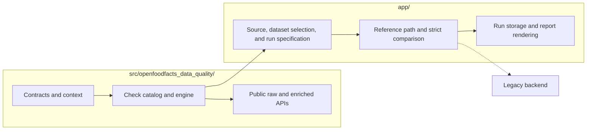

[Back to documentation index](../index.md)

# About the system architecture

The repository has one reusable layer in `src/` and one application layer in
`app/`.

## Repository split

`src/openfoodfacts_data_quality/` owns the
[shared runtime](runtime-model.md#why-the-runtime-is-split).

`app/` owns orchestration, source loading, dataset selection, the
[reference path](reference-data-and-parity.md#why-the-reference-path-exists),
optional [strict comparison](reference-data-and-parity.md#strict-comparison),
stored review data, and report generation.

`app/` depends on `src/`. `src/` does not depend on `app/`.

## Shared runtime responsibilities

`src/openfoodfacts_data_quality/` provides:

- check contracts and
  [metadata](../reference/check-metadata-and-selection.md)
- [`NormalizedContext`](runtime-model.md#normalizedcontext) contracts
- packaged Python and DSL checks
- catalog loading and evaluator selection
- context building and projection
- public [`raw` and `enriched` Python APIs](../how-to/use-the-python-library.md)

## Application responsibilities

`app/` provides:

- [source snapshot](../reference/glossary.md#source-snapshot) loading from
  DuckDB
- dataset profile resolution and row selection for one application run
- reference loading through the
  [reference path](reference-data-and-parity.md#why-the-reference-path-exists),
  with
  [reference result cache](../reference/run-configuration-and-artifacts.md#reference-result-cache)
  reuse first and backend materialization on cache misses
- [ReferenceResult](../reference/data-contracts.md#referenceresult) caching,
  loading, envelope validation, and projection onto reference findings plus
  enriched snapshots
- [RunResult](../reference/data-contracts.md#runresult) accumulation
- migration catalog loading for planning metadata and profile filtering
- [strict comparison](reference-data-and-parity.md#strict-comparison)
- parity store persistence for run telemetry, mismatches, and review metadata
- [report rendering](../reference/report-artifacts.md#html-report), snippet
  extraction, and local preview

## Repository map

- `src/openfoodfacts_data_quality/checks/`: Check definitions, the DSL
  subsystem, registry helpers, catalog loading, and execution.
- `src/openfoodfacts_data_quality/context/`: Context building, path metadata,
  and input projection into `NormalizedContext`.
- `src/openfoodfacts_data_quality/contracts/`: Stable runtime contracts shared
  across the reusable library APIs.
- `app/application.py`: Application service that executes one run and renders
  the review site.
- `app/artifacts.py`: Artifact workspace preparation for `artifacts/latest/`.
- `app/source/`: Source snapshot access and dataset profile helpers.
- `app/run/`: Run settings, profile loading, preparation, batching, scheduling,
  accumulation, serialization, and orchestration.
- `app/reference/`: Runtime data for the reference side, cache handling, result
  loading, envelope validation, materializers, and finding normalization.
- `app/legacy_backend/`: The Perl runtime boundary and the persistent session
  pool that drives it.
- `app/migration/`: Migration family catalog loading and planning metadata used
  by run selection and review.
- `app/parity/`: Strict comparison logic.
- `app/storage/`: Application-owned persistence for recorded runs and parity
  review state.
- `app/report/`: Static report rendering, JSON download bundling, and snippet
  presentation.
- `config/check-profiles.toml`: Named check presets.
- `config/dataset-profiles.toml`: Named dataset presets for source rows.

## Boundary rules

Put reusable execution behavior in `src/`.

Put source loading, dataset selection, legacy backend integration,
[strict comparison](reference-data-and-parity.md#strict-comparison), mismatch
governance, review persistence, and
[report artifacts](../reference/report-artifacts.md) in `app/`.

## Related information

- [About the runtime model](runtime-model.md)
- [About application runs](application-runs.md)
- [About the project scope](project-scope.md)

[Back to documentation index](../index.md)
