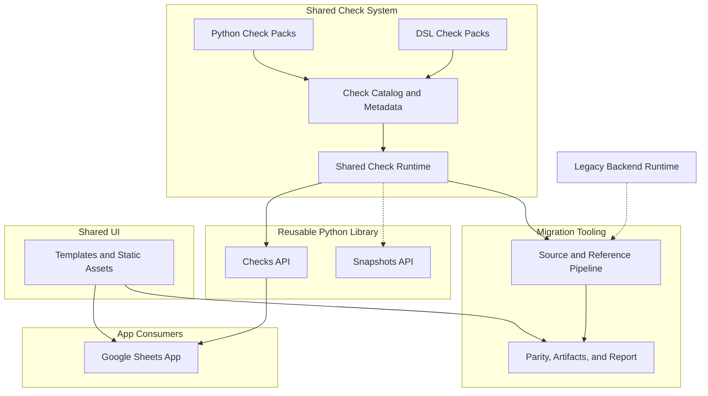

[Back to documentation index](../index.md)

# About the system architecture

The repository has one reusable layer in `src/`, one migration tooling in
`migration/`, one app consumer in `apps/`, and one shared presentation layer in
`ui/`.

## Project overview

`src/off_data_quality/` owns the
[shared runtime](runtime-model.md#why-the-runtime-is-split).

In the diagram, `Checks API` refers to `off_data_quality.checks`. `Snapshots
API` refers to the reserved `off_data_quality.snapshots` namespace.

The wheel also exposes stable advanced namespaces for migration tooling:

- `off_data_quality.catalog`
- `off_data_quality.context`
- `off_data_quality.contracts`
- `off_data_quality.execution`
- `off_data_quality.metadata`

`migration/` owns orchestration, source loading, dataset selection, the
[reference path](reference-data-and-parity.md#why-the-reference-path-exists),
optional [strict comparison](reference-data-and-parity.md#strict-comparison),
stored review data, and report generation.

`migration/` depends on `src/`. `src/` does not depend on `migration/`.

`apps/google_sheets/` owns the Google Sheets browser app and depends on the
packaged library plus `ui/`.

`ui/` owns shared templates and static assets. It does not depend on domain
code.

## Shared runtime responsibilities

`src/off_data_quality/` provides:

- check contracts and
  [metadata](../reference/check-metadata-and-selection.md)
- [`CheckContext`](runtime-model.md#checkcontext) contracts
- packaged Python and DSL checks
- catalog loading and evaluator selection
- context building and projection
- the [`checks` Python API](../how-to/use-the-python-library.md)
- the reserved `snapshots` placeholder namespace
- the stable advanced namespaces used by migration tooling

## Migration tooling responsibilities

`migration/` provides:

- [source snapshot](../reference/glossary.md#source-snapshot) loading from
  JSONL or DuckDB
- dataset profile resolution and row selection for one migration run
- reference loading through the
  [reference path](reference-data-and-parity.md#why-the-reference-path-exists),
  with
  [reference result cache](../reference/run-configuration-and-artifacts.md#reference-result-cache)
  reuse first and backend materialization on cache misses
- [ReferenceResult](../reference/data-contracts.md#referenceresult) caching,
  loading, envelope validation, and projection onto reference findings plus
  reference check contexts
- [RunResult](../reference/data-contracts.md#runresult) accumulation
- [strict comparison](reference-data-and-parity.md#strict-comparison)
- parity store persistence for run telemetry, mismatches, and review metadata
- [report rendering](../reference/report-artifacts.md#html-report), snippet
  extraction, and local preview

## App responsibilities

`apps/google_sheets/` provides:

- the local Google Sheets browser workflow and HTTP server
- CSV upload and validation round-trips through the public wheel API
- Google-specific browser integration and local packaging

## Shared UI responsibilities

`ui/` provides:

- shared Jinja templates, template rendering helpers, CSS, and favicon assets
- shared page shell building blocks used by report and app entrypoints

## Repository map

- `src/off_data_quality/checks/`: Check definitions, the DSL
  subsystem, registry helpers, catalog loading, and execution.
- `src/off_data_quality/context/`: Context building, path metadata,
  and input projection into `CheckContext`.
- `src/off_data_quality/contracts/`: Stable runtime contracts shared
  across the reusable library APIs.
- `migration/site_builder.py`: Service that executes one run and renders the
  review site.
- `migration/artifacts.py`: Artifact workspace preparation for `artifacts/latest/`.
- `migration/source/`: Product document source loading and dataset profile helpers.
- `migration/run/`: Run settings, profile loading, preparation, batching, scheduling,
  accumulation, serialization, and orchestration.
- `migration/reference/`: Runtime data for the reference side, cache handling, result
  loading, envelope validation, materializers, and finding normalization.
- `migration/legacy_backend/`: The Perl runtime boundary and the persistent session
  pool that drives it.
- `migration/legacy_source.py`: Legacy source analysis used for snippet provenance
  and inventory export workflows.
- `migration/planning.py`: Migration family catalog loading and planning
  metadata used by run selection and review.
- `migration/parity/`: Strict comparison logic.
- `migration/storage/`: Migration-owned persistence for recorded runs and parity
  review state.
- `migration/report/`: Static report rendering, JSON download bundling, and snippet
  presentation.
- `apps/google_sheets/`: Google Sheets app server, browser workflow, packaging,
  and app specific assets.
- `ui/rendering.py`: Shared Jinja environment construction for report and app
  entrypoints.
- `ui/templates/`: Shared base template and page shell macros.
- `ui/static/`: Shared CSS and favicon assets.
- `config/check-profiles.toml`: Named check presets.
- `config/dataset-profiles.toml`: Named dataset presets for source selection.

## Boundary rules

Put reusable execution behavior in `src/`.

Put source loading, dataset selection, legacy backend integration,
[strict comparison](reference-data-and-parity.md#strict-comparison), mismatch
governance, review persistence, and
[report artifacts](../reference/report-artifacts.md) in `migration/`.

Put app-specific browser logic, local app packaging, and app endpoints in
`apps/`.

Put shared templates and static presentation assets in `ui/`.

The repository enforces import boundaries with `import-linter` contracts in
`pyproject.toml`. It keeps package surface checks in
`tests/test_package_namespace.py` and keeps the wheel source-tree path rule in
`tests/test_packaging_boundaries.py`.

## Related information

- [About the runtime model](runtime-model.md)
- [About migration runs](migration-runs.md)
- [About the project scope](project-scope.md)

[Back to documentation index](../index.md)
