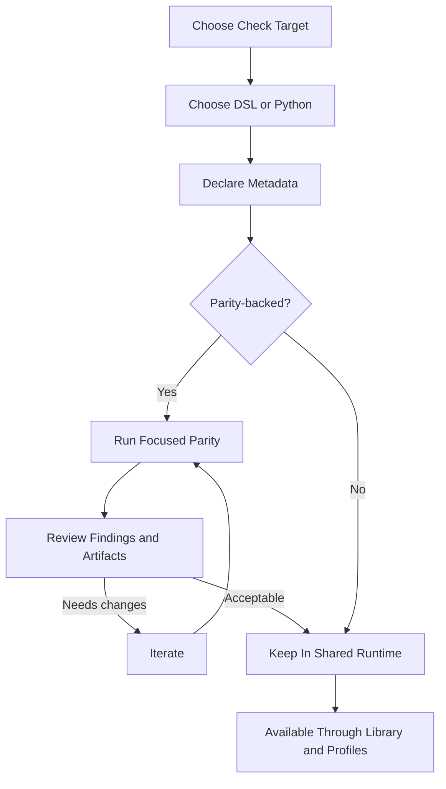

# Authoring Checks

[Documentation](../index.md) / [Guides](index.md) / Authoring Checks

Author checks as shared packaged definitions.

## Workflow

## 1. Decide The Runtime Shape

Before writing code, decide:

- which input surface the check really needs
- whether it must be parity-backed
- whether the logic should be expressed in the DSL or in Python

This avoids writing a check first and discovering later that its metadata model is wrong.

## 2. Choose DSL Or Python

Use the DSL when the check is a readable boolean predicate over approved normalized-context paths.

Use Python when the check needs:

- loops or richer control flow
- helper-driven logic
- multi-step numeric reasoning
- dynamic emitted codes

Choose the language that makes the check easy to review.

## 3. Put The Check In A Pack

- Python checks live in `src/openfoodfacts_data_quality/checks/packs/python/`
- DSL checks live in `src/openfoodfacts_data_quality/checks/packs/dsl/`

Checks are packaged content, not local experiment files.

## 4. Declare Metadata Correctly

The important metadata decisions are:

- `parity_baseline`
- jurisdictions
- required context paths
- optional `legacy_identity` when the legacy mapping is not the default one

Most integration bugs come from wrong metadata, not from wrong syntax.

## 5. Validate Early

- add or update tests
- run the DSL validator if you changed DSL packs
- use a focused profile when you are working on a parity-backed check

### DSL Validation And Editor Support

The DSL has two validation layers:

- structural validation against the shared JSON Schema in [definitions.schema.json](../../src/openfoodfacts_data_quality/checks/dsl/schema/definitions.schema.json)
- structural and semantic validation through [scripts/validate_dsl.py](../../scripts/validate_dsl.py)

The supported language features are also described explicitly in [capabilities.json](../../src/openfoodfacts_data_quality/checks/dsl/capabilities.json).

In this repository, VS Code support is already configured:

- [`.vscode/settings.json`](../../.vscode/settings.json) associates the DSL YAML files with the schema
- [`.vscode/tasks.json`](../../.vscode/tasks.json) defines `Validate DSL Checks` and `Watch DSL Checks`

That gives you:

- inline structural feedback from the YAML schema integration
- terminal or task-driven validation for semantic issues such as unsupported fields

Other IDEs with YAML and JSON Schema support can likely be configured similarly, but this repository only documents the VS Code path today.

## 6. Keep The Check Contract Clean

Checks should depend on normalized context paths, not on repo-local helper shapes being introduced into the public model.

If a check needs new stable data, add it to the normalized contract.

[Back to Guides](index.md) | [Back to Documentation](../index.md)
