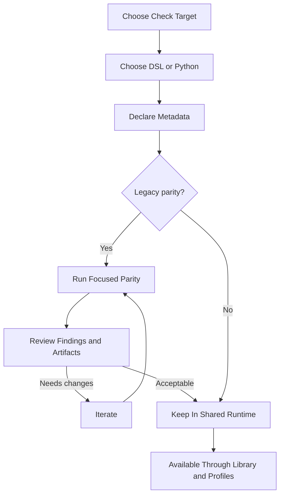

# Authoring Checks

[Documentation](../index.md) / [Guides](index.md) / Authoring Checks

Keep check logic in the shared packaged runtime. Avoid special cases local to the application.

## Workflow

The table below restates the workflow step by step.

| Step | Diagram Node | Purpose |
| --- | --- | --- |
| 1 | Choose Check Target | Decide which product quality invariant the check should express and whether it belongs in the shared runtime at all. |
| 2 | Choose DSL or Python | Pick the definition language that keeps the logic clear and reviewable. |
| 3 | Declare Metadata | Set the contract that drives selection and execution, including input surface, parity baseline, jurisdictions, and required context paths. |
| 4 | Legacy parity? | Decide whether the check should be compared against legacy behavior or can remain runtime only. |
| 5 | Run Focused Parity | For parity work, run a narrow validation loop so mismatches are easy to inspect. |
| 6 | Review Findings and Artifacts | Inspect mismatches, snippets, and report output before deciding whether the migrated behavior is acceptable. |
| 7 | Iterate | Refine the check, metadata, or tests until the behavior is acceptable. |
| 8 | Keep In Shared Runtime | Land the final definition in the packaged check system, not in orchestration code local to `app/`. |
| 9 | Available Through Library and Profiles | Once packaged, the check becomes selectable through the public library APIs and through application profiles. |

## 1. Runtime Shape

Before writing the check itself, decide:

- which input surface the check truly needs
- whether it must be compared against legacy behavior
- whether the logic belongs in the DSL or in Python

Most avoidable integration problems come from getting the metadata wrong early, not from getting the boolean condition wrong later.

## 2. DSL Or Python

Use the DSL when the check is a readable boolean predicate over approved normalized context paths.

Use Python when the check needs:

- loops or richer control flow
- logic driven by helpers
- multi step numeric reasoning
- dynamic emitted codes

Choose the language that keeps the logic easiest to review.

## 3. Check Packs

- Python checks live under `src/openfoodfacts_data_quality/checks/packs/python/`
- DSL checks live under `src/openfoodfacts_data_quality/checks/packs/dsl/`

Checks are packaged repository content. Do not hide them in code local to `app/`.

## 4. Metadata

The important metadata choices are:

- `parity_baseline`
- jurisdictions
- required context paths
- optional `legacy_identity` when the legacy mapping is not the default one

For Python checks, the declared required context paths are validated against inferred context access. They are part of the executable contract.

## 5. Validation

- add or update tests
- validate DSL packs if you changed DSL definitions
- use a focused profile when working on a parity check

## DSL Validation

The DSL has two validation layers:

- structural validation against the shared JSON Schema at `src/openfoodfacts_data_quality/checks/dsl/schema/definitions.schema.json`
- structural and semantic validation through `scripts/validate_dsl.py`

The supported language surface is described in `src/openfoodfacts_data_quality/checks/dsl/capabilities.json`.

For VS Code:

- `.vscode/settings.json` associates the DSL YAML files with the schema
- `.vscode/tasks.json` defines validation tasks for one shot and watch mode runs

## 6. Contract Hygiene

Checks should depend on normalized context paths, not on helper shapes local to `app/` or ad hoc payloads introduced only for one rule.

If a check needs new stable data, extend the normalized contract and update the surrounding documentation and tests in the same task.

## Next Reads

- [Check System](../architecture/check-system.md)
- [Data Contracts](../architecture/data-contracts.md)
- [Testing and Quality](../reference/testing-and-quality.md)
