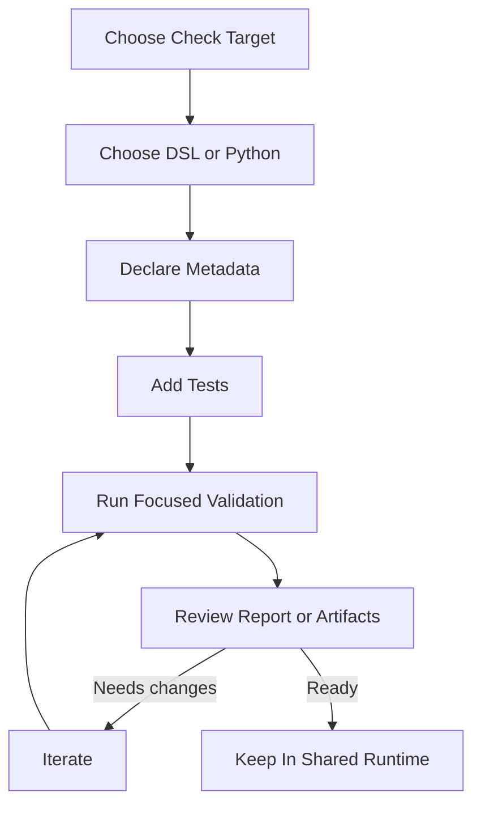

# Author Checks

[Back to documentation](../index.md)

Add migrated checks here and keep the logic inside the shared runtime.

## Before you start

- choose the [input surface](../concepts/runtime-model.md#input-surfaces) the rule really needs
- decide whether the check should use a [`parity_baseline`](../concepts/reference-and-parity.md#parity-baseline) of `legacy` or `none`
- choose the [definition language](../concepts/check-model.md#dsl-and-python) that keeps the rule readable

## Follow the workflow



1. Choose the rule and the surface it belongs to.
2. Choose `dsl` or `python`.
3. Declare [metadata](../reference/check-metadata-and-selection.md) that matches the rule contract.
4. Add or update tests.
5. Run a narrow validation loop.
6. Review report output or [JSON artifacts](../reference/report-artifacts.md) when parity applies.
7. Keep the final definition in the shared runtime, not in `app/`.

## Choose the definition language

Use the [DSL](../concepts/check-model.md#dsl-and-python) when the rule is a readable boolean predicate over approved [normalized context](../concepts/runtime-model.md#normalized-context) paths and one static severity is enough.

Use Python when the rule needs:

- loops or aggregation
- logic that depends on helpers
- numeric reasoning across multiple steps
- dynamic emitted codes

## Put the definition in the right pack

- Python checks live under `src/openfoodfacts_data_quality/checks/packs/python/`.
- DSL checks live under `src/openfoodfacts_data_quality/checks/packs/dsl/`.

Checks are packaged repository content. Do not hide them in `app/`.

## Set the metadata

- `supported_input_surfaces` says which [input surfaces](../concepts/runtime-model.md#input-surfaces) can run the check.
- `required_context_paths` records the stable dotted paths the rule needs inside [NormalizedContext](../concepts/runtime-model.md#normalized-context).
- `parity_baseline` decides whether the check enters [strict comparison](../concepts/reference-and-parity.md#strict-comparison).
- `jurisdictions` limits the markets where the rule is eligible.
- `legacy_identity` maps the check to the correct legacy emitted code template when the default mapping is not enough.

For Python checks, declared `required_context_paths` are validated against inferred context access and helper annotations.

## Validate the change

1. Add or update tests.
2. Validate DSL packs when you changed DSL files.

   ```bash
   .venv/bin/python scripts/validate_dsl.py
   ```

   This command validates the shared JSON Schema and the semantic rules for repository DSL packs.

3. Use a focused [check profile](../concepts/check-model.md#check-profiles) when you work on a [parity](../concepts/reference-and-parity.md) check.
4. Finish with the repository sweep.

   ```bash
   make quality
   ```

If the change touches the full application flow, reference loading, strict comparison, or report output, also run the Docker application flow before you call the work done.

## Extend contracts on purpose

Checks depend on [normalized context](../concepts/runtime-model.md#normalized-context) paths, not on helper shapes local to `app/`.

When a Python helper needs anything broader than leaf context values, annotate it with `@depends_on_context_paths(...)`.

If a check needs new stable data, extend the [normalized contract](../reference/data-contracts.md#normalizedcontext) and update tests plus docs in the same task.

## Use editor support for DSL packs

- `.vscode/settings.json` associates DSL YAML files with the schema.
- `.vscode/tasks.json` provides `Validate DSL Checks` and `Watch DSL Checks`.

[Back to documentation](../index.md)
