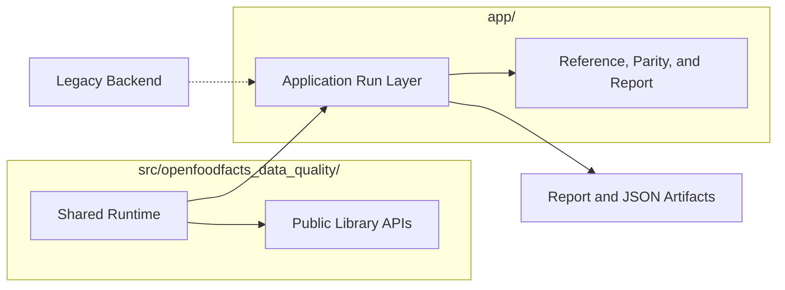

# Project Overview and Scope

[Back to documentation](../index.md)

The repository migrates Open Food Facts data quality checks from the [legacy Perl backend](../concepts/how-an-application-run-works.md#legacy-backend) into a reusable Python system.

## Repository Split

The repository keeps reusable runtime logic in `src/openfoodfacts_data_quality/` and application orchestration in `app/`.

Python callers can use the [shared runtime](../concepts/runtime-model.md#shared-runtime) without the [application run layer](../concepts/runtime-model.md#application-run-layer). Compared runs and enriched application runs still depend on the [legacy backend](../concepts/how-an-application-run-works.md#legacy-backend) through the [reference path](../concepts/reference-and-parity.md#reference-path). Live backend execution happens only on cache misses.

## What it can do today

- run migrated checks through a shared Python runtime with explicit [raw and enriched input surfaces](../concepts/runtime-model.md#input-surfaces)
- keep [raw, enriched, and normalized contracts](../reference/data-contracts.md) owned by the Python runtime
- package checks in Python and [DSL](../concepts/check-model.md#dsl-and-python)
- execute compared checks and checks that run without comparison through the application run layer
- write static HTML output plus [JSON artifacts](../reference/run-configuration-and-artifacts.md) for review

## What is stable enough to build on

- the shared [runtime contracts](../reference/data-contracts.md)
- the [normalized context](../reference/data-contracts.md#normalizedcontext) model
- the packaged [check catalog](../reference/check-metadata-and-selection.md)
- [application execution](../concepts/how-an-application-run-works.md) as a regular workflow
- [JSON run plus snippet artifacts](../reference/report-artifacts.md)

## What is still changing

- how broad the [DSL](../concepts/check-model.md#dsl-and-python) should become
- how full corpus runs should be operated outside short local loops
- how the [report](../reference/report-artifacts.md) should evolve beyond migration review

## Current limits

- the repository is not yet a full replacement for every legacy data-quality rule
- compared runs and enriched application runs still depend on the [legacy backend contract](../reference/data-contracts.md#referenceresult) through the [reference path](../concepts/reference-and-parity.md#reference-path)
- the [report](../reference/report-artifacts.md) still optimizes for review rather than exhaustive debugging detail
- the public Python APIs are explicit [project contracts](../reference/data-contracts.md), but they are not yet durable compatibility promises

## How a typical run works

1. Read a DuckDB [source snapshot](../reference/glossary.md#source-snapshot).
2. Resolve reference enrichment and findings through the [reference path](../concepts/reference-and-parity.md#reference-path), which checks the cache first and falls back to the [legacy backend](../concepts/how-an-application-run-works.md#legacy-backend) on cache misses when selected checks need it.
3. Execute the selected migrated checks.
4. Compare reference and migrated findings under [strict comparison](../concepts/reference-and-parity.md#strict-comparison) when a [legacy baseline](../concepts/reference-and-parity.md#parity-baseline) exists.
5. Write the [report](../how-to/review-a-run-report.md) and [JSON artifacts](../reference/run-configuration-and-artifacts.md).

[Back to documentation](../index.md)
