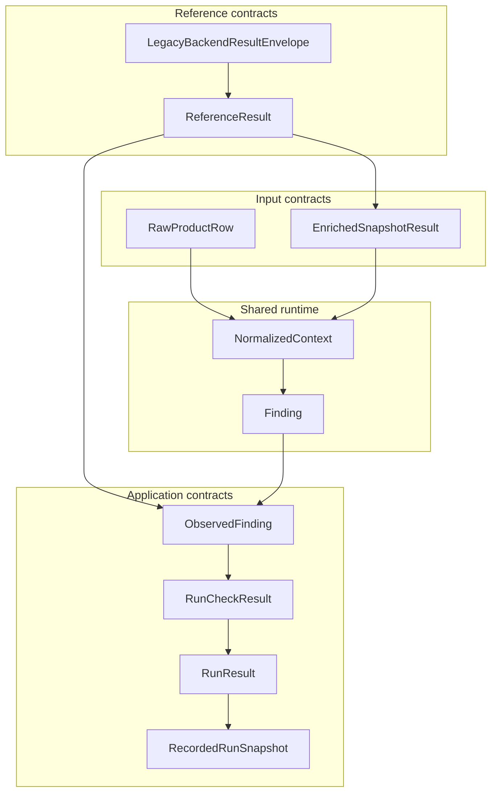

[Back to documentation index](../index.md)

# Data contracts

These contracts define the main data boundaries between runtime layers.

## Contract map

## Input contracts

### RawProductRow

`RawProductRow` is the input contract for raw runs loaded from a DuckDB
[source snapshot](glossary.md#source-snapshot).

Use this contract when the selected checks can run from public product rows
alone.

Reference points:

- Canonical model: `src/openfoodfacts_data_quality/contracts/raw.py`
- Column anchor: `openfoodfacts_data_quality.raw_products.RAW_INPUT_COLUMNS`
- Related runtime surface: `raw_products`

Checks that only need public product fields can stay on this surface and avoid
enriched snapshots. In application runs, checks on this surface can still need
the [reference path](../explanation/reference-data-and-parity.md#why-the-reference-path-exists)
when strict comparison requires reference findings.

### EnrichedSnapshotResult

`EnrichedSnapshotResult` is the stable library contract for enriched inputs.

It wraps:

- a product `code`
- an `enriched_snapshot` payload with structured `product`, `flags`,
  `category_props`, and `nutrition` sections

In [application runs](../explanation/application-runs.md), the legacy backend
emits a versioned result envelope whose stable payload includes
`ReferenceResult.enriched_snapshot`. The application projects that validated
payload into `EnrichedSnapshotResult`.

## Input surfaces

[Input surfaces](../explanation/runtime-model.md#input-surfaces) describe two
execution situations:

- `raw_products`: The check can run from the public source snapshot alone.
- `enriched_products`: The check depends on stable enriched data that must be
  materialized or provided.

The chosen surface changes:

- which checks are eligible for a run
- whether the
  [reference path](../explanation/reference-data-and-parity.md#why-the-reference-path-exists)
  must run
- which normalized context fields are available

The application also has
[dataset profiles](run-configuration-and-artifacts.md#dataset-profiles), but
those profiles change which rows are selected for one run, not the runtime
contract itself.

## Runtime contracts

### NormalizedContext

Checks do not consume raw rows or backend payloads directly. They consume
`NormalizedContext`.

`NormalizedContext` is the central shared runtime contract. It separates checks
from source specific input structures. It gives raw and enriched runs one
execution model. It also defines the dotted paths used by
[DSL](../explanation/migrated-checks.md#definition-languages) and input surface
inference.

## Reference contracts

### LegacyBackendResultEnvelope

`LegacyBackendResultEnvelope` is the versioned result contract emitted across
the language boundary by the Perl wrapper.

It includes:

- `contract_kind`
- `contract_version`
- `reference_result`

Python validates this envelope before the application uses the underlying
`ReferenceResult` payload.

### ReferenceResult

The application
[reference path](../explanation/reference-data-and-parity.md#why-the-reference-path-exists)
returns `ReferenceResult`.

Fields:

- `code`
- `enriched_snapshot`
- `legacy_check_tags`

This contract is owned by the Python runtime even when the legacy backend
produces the payload.

## Output and review contracts

### Finding

`Finding` is the library output of the shared runtime.

### ObservedFinding

`ObservedFinding` is the comparison model used by
[strict comparison](../explanation/reference-data-and-parity.md#strict-comparison).
Reference and migrated outputs are converted to this contract before
comparison.

### RunCheckResult

`RunCheckResult` is the application result for one check. It records the check
definition, whether the check is `compared` or `runtime_only`, migrated counts,
reference counts, exact mismatch totals, and retained mismatch examples.

The retained examples are capped by the configured mismatch example budget.

### RunResult

`RunResult` is the canonical application summary for one run. It drives the
[HTML report](report-artifacts.md#html-report),
[`run.json`](report-artifacts.md#runjson),
[snippet artifacts](report-artifacts.md#snippetsjson), and JSON download
bundles.

`run.json` and `snippets.json` are versioned JSON artifacts. They include root
`kind` and `schema_version` metadata around the serialized payload.

### RecordedRunSnapshot

`RecordedRunSnapshot` is the read model the report layer uses when it renders
from a recorded run in the parity store.

It wraps:

- the persisted `run.json` payload
- the validated `RunResult`
- recorded dataset profile metadata
- governance counts for expected differences
- active migration family metadata

This model belongs to the application review layer. It is not part of the reusable
library surface.

## Stability

Treat these contracts as stable project boundaries.

Changes to them often affect
[check selection](check-metadata-and-selection.md#selection-inputs), context
projection, DSL validation,
[reference loading](../explanation/reference-data-and-parity.md#why-the-reference-path-exists),
[comparison behavior](../explanation/reference-data-and-parity.md#strict-comparison),
[run store persistence](run-configuration-and-artifacts.md#parity-store), and
[artifact generation](report-artifacts.md).

## See also

- [About the runtime model](../explanation/runtime-model.md)
- [About reference data and parity](../explanation/reference-data-and-parity.md)
- [Report artifacts](report-artifacts.md)

[Back to documentation index](../index.md)
