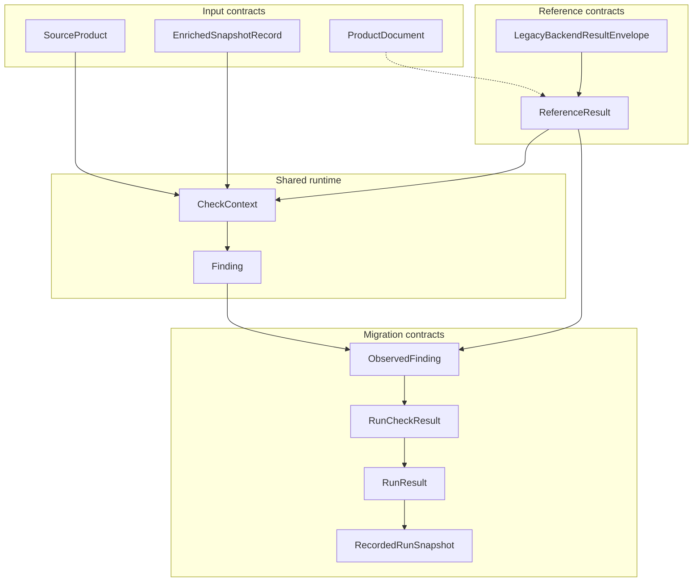

[Back to documentation index](../index.md)

# Data contracts

These contracts define the main data boundaries between runtime layers.

## Contract map

## Input contracts

### SourceProduct

`SourceProduct` is the normalized source product contract used by the shared
runtime and the public `checks` library API.

Library callers pass rows to `off_data_quality.checks.run(...)`. It validates
canonical rows, applies explicit column remapping when provided, and then
executes the checks.

The checks facade also accepts a small set of supported OFF row/document
representations directly, including complete official CSV rows, full JSONL
product documents, Parquet rows, and DuckDB relations loaded from those
formats. It normalizes each supported representation to `SourceProduct` before
execution.

For flexibility, the facade also accepts sparse canonical-compatible rows and
ignores extra columns. It does not treat partial subsets of structured OFF
export/document shapes as separate supported contracts.

If callers want to prepare rows once and reuse the normalized result across
multiple runs, they can call `off_data_quality.checks.prepare(...)` first and
then pass the resulting `SourceProduct` values to `checks.run(...)`.

The public `checks` API runs on one canonical contract. Its internal
preparation step accepts only supported loaded row shapes and fails when the
input is not supported.

Reference points:

- Canonical model: `src/off_data_quality/contracts/source_products.py`
- `checks` API: `src/off_data_quality/checks/__init__.py`
- Related runtime provider: `source_products`

`off_data_quality` is the public import namespace. In a source checkout, the
shared implementation and contracts live under `src/off_data_quality/`. Wheel
files use the distribution name `openfoodfacts_data_quality`.

Checks that only need source product fields can stay on this provider and avoid
enriched snapshots.

Migration runs still load full product documents into the migration-owned
`ProductDocument` contract, but strict parity now runs on
`enriched_snapshot` input rather than on source-side `SourceProduct` batches.

### ProductDocument

`ProductDocument` is the migration-owned full product contract for parity runs. It is
not part of the public library API.

Migration source adapters build `ProductDocument` values from JSONL source
snapshots or DuckDB snapshots with a `products` table. The reference path sends
that full document to the legacy backend. Strict parity then compares legacy
findings against migrated findings built from the derived
`ReferenceResult.enriched_snapshot`.

Reference point:

- Contract: `migration/source/models.py`
- Migration source adapters: `migration/source/product_documents.py`

### EnrichedSnapshotRecord

`EnrichedSnapshotRecord` is the stable enriched-input contract owned by the
shared runtime.

It wraps:

- a product `code`
- an `enriched_snapshot` payload with structured `product`, `flags`,
  `category_props`, and `nutrition` sections

In [migration runs](../explanation/migration-runs.md), the legacy backend
emits a versioned result envelope whose stable payload includes
`ReferenceResult.enriched_snapshot`. The repository also keeps
`off_data_quality.snapshots` reserved as the future public namespace for direct
enrichment-driven library usage.

## Reference contracts

### LegacyBackendResultEnvelope

`LegacyBackendResultEnvelope` is the versioned result contract emitted across
the language boundary by the Perl wrapper.

It includes:

- `contract_kind`
- `contract_version`
- `reference_result`

Python validates this envelope before migration tooling uses the underlying
`ReferenceResult` payload.

### ReferenceResult

The migration tooling
[reference path](../explanation/reference-data-and-parity.md#why-the-reference-path-exists)
returns `ReferenceResult`.

Fields:

- `code`
- `enriched_snapshot`
- `legacy_check_tags`

This contract is owned by the Python runtime even when the legacy backend
produces the payload. The migration tooling then derives:

- `CheckContext` for `enriched_snapshots` migrated-check input
- normalized reference findings for strict comparison

## Context providers

[Context providers](../explanation/runtime-model.md#context-providers) describe two
execution situations:

- `source_products`: The provider builds contexts from source products alone.
- `enriched_snapshots`: The provider builds contexts from stable enriched data
  that must be materialized or provided.

The chosen provider changes:

- which required context paths are available to checks
- whether the
  [reference path](../explanation/reference-data-and-parity.md#why-the-reference-path-exists)
  must run
- which check context fields are available

The migration tooling also has
[dataset profiles](run-configuration-and-artifacts.md#dataset-profiles), but
those profiles change which rows are selected for one run, not the runtime
contract itself.

## Runtime contracts

### CheckContext

Checks do not consume source products or backend payloads directly. They consume
`CheckContext`.

`CheckContext` is the central shared runtime contract. It separates checks
from source specific input structures. Source product and enriched snapshot
providers share one execution model. It also defines the dotted paths used by
[DSL](../explanation/migrated-checks.md#definition-languages) and capability
resolution.

## Output and review contracts

### Finding

`Finding` is the library output of the shared runtime.

### ObservedFinding

`ObservedFinding` is the comparison model used by
[strict comparison](../explanation/reference-data-and-parity.md#strict-comparison).
Reference and migrated outputs are converted to this contract before
comparison.

### RunCheckResult

`RunCheckResult` is the migration result for one check. It records the check
definition, whether the check is `compared` or `runtime_only`, migrated counts,
reference counts, exact mismatch totals, and retained mismatch examples.

The retained examples are capped by the configured mismatch example budget.

### RunResult

`RunResult` is the canonical migration summary for one run. It drives the
[HTML report](report-artifacts.md#html-report),
[`run.json`](report-artifacts.md#runjson),
[snippet artifacts](report-artifacts.md#snippetsjson), and JSON download
bundles.

`run.json` and `snippets.json` are versioned JSON artifacts. They include root
`kind` and `schema_version` metadata around the serialized payload.

### RecordedRunSnapshot

`RecordedRunSnapshot` is the read model the report layer uses when it renders
from a recorded run in the parity store.

It wraps:

- the persisted `run.json` payload
- the validated `RunResult`
- recorded dataset profile metadata

This model belongs to the migration review layer. It is not part of the
reusable library surface.

## Stability

Treat these contracts as stable project boundaries.

Changes to them often affect
[check selection](check-metadata-and-selection.md#selection-inputs), context
projection, DSL validation,
[reference loading](../explanation/reference-data-and-parity.md#why-the-reference-path-exists),
[comparison behavior](../explanation/reference-data-and-parity.md#strict-comparison),
[run store persistence](run-configuration-and-artifacts.md#parity-store), and
[artifact generation](report-artifacts.md).

## See also

- [About the runtime model](../explanation/runtime-model.md)
- [About reference and parity](../explanation/reference-data-and-parity.md)
- [Report artifacts](report-artifacts.md)

[Back to documentation index](../index.md)
