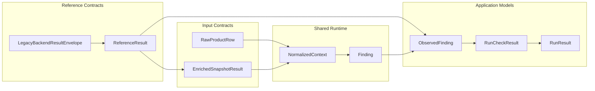

# Data Contracts

[Back to documentation](../index.md)

These contracts mark the main data boundaries between runtime layers.

## Inputs

The [check catalog](../concepts/check-model.md#packaged-checks) spans two [input surfaces](../concepts/runtime-model.md#input-surfaces) because not every check needs the same source data.

### Raw Rows

Raw runs start from `RawProductRow` objects loaded from a DuckDB [source snapshot](glossary.md#source-snapshot).

The canonical model lives in `src/openfoodfacts_data_quality/contracts/raw.py`, and OFF column names are anchored by `openfoodfacts_data_quality.raw_products.RAW_INPUT_COLUMNS`.

Checks that only need public product fields can stay on this surface and avoid the [reference path](../concepts/reference-and-parity.md#reference-path).

### Enriched Snapshot

Enriched runs start from `EnrichedSnapshotResult`, which wraps:

- a product `code`
- an `enriched_snapshot` payload with structured `product`, `flags`, `category_props`, and `nutrition` sections

This is the stable library contract for enriched inputs, and the Python runtime owns it.

In [application runs](../concepts/how-an-application-run-works.md), the legacy backend emits a versioned result envelope whose stable payload includes `ReferenceResult.enriched_snapshot`. The application projects that validated payload into `EnrichedSnapshotResult`.

## Input Surfaces

`raw_products` and `enriched_products` describe two execution situations:

- `raw_products`
  the check can run from the public source snapshot alone
- `enriched_products`
  the check depends on stable enriched data that must be materialized or provided

The choice changes:

- which checks are eligible for a run
- whether the reference path must run
- which normalized context fields are available

## Runtime

### NormalizedContext

Checks do not consume raw rows or backend payloads directly. They consume `NormalizedContext`.

`NormalizedContext` is the central shared runtime contract because it decouples checks from input shapes tied to one source, lets raw and enriched runs share one execution model, and defines the dotted paths that are valid for [DSL](../concepts/check-model.md#dsl-and-python) use and input surface inference.

## Reference

### ReferenceResult

The application [reference path](../concepts/reference-and-parity.md#reference-path) returns `ReferenceResult`.

Fields:

- `code`
- `enriched_snapshot`
- `legacy_check_tags`

The boundary between languages is explicit. The legacy backend emits `LegacyBackendResultEnvelope`, which carries `contract_kind`, `contract_version`, and a stable `reference_result` payload. Python validates that envelope and then works with `ReferenceResult`.

## Outputs

### Finding

`Finding` is the library output of the shared runtime.

### ObservedFinding

`ObservedFinding` is the comparison model used by [strict comparison](../concepts/reference-and-parity.md#strict-comparison). Reference and migrated outputs are adapted into this shape before comparison.

### RunCheckResult

`RunCheckResult` is the application result for one check. It records the check definition, whether the check is `compared` or `runtime_only`, migrated counts, and reference counts plus mismatch details when comparison applies.

### RunResult

`RunResult` is the overall application summary for one run. It drives the HTML report, `run.json`, snippet artifacts, and JSON download bundles.

`run.json` and `snippets.json` are versioned JSON artifacts. They carry root `kind` and `schema_version` metadata around the serialized payload.

`snippets.json` records snippet provenance with `origin="implementation"` for current repository code and `origin="legacy"` for matched legacy source spans. Each check entry also records `legacy_snippet_status`.

## Stability

Treat these contracts as stable project boundaries.

Changes to them often affect [check selection](check-metadata-and-selection.md), context projection, DSL validation, reference loading, comparison behavior, and artifact generation.

[Back to documentation](../index.md)
